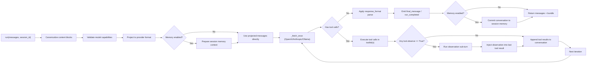

# miso

`miso` 是一个轻量的 Python Agent Builder，核心目标是把“多轮工具调用代理”拆成可组合的最小部件：

- 一个高层多代理 API：`Agent` / `Team`
- 一个主循环引擎：`broth`
- 一个会话记忆层：`memory`（`MemoryManager` + context window 策略）
- 一套工具抽象：`tool` / `toolkit`
- 一个结构化输出层：`response_format`
- 一个多模态输入规范层：`media` + canonical content blocks
- 一个远程工具桥接层：`mcp`
- 三个可直接落地的内置工具包：`workspace_toolkit` / `terminal_toolkit` / `interaction_toolkit`

它支持 OpenAI / Anthropic / Ollama 三类 provider，并且尽量保持接口一致。

---

## 目录

1. [快速开始](#快速开始)
2. [对外 API（`miso/__init__.py`）](#对外-apimiso__init__py)
3. [组件总览（按代码模块）](#组件总览按代码模块)
4. [分层架构与流层逻辑](#分层架构与流层逻辑)
5. [`broth` 主循环详解](#broth-主循环详解)
6. [Session Memory（Context Window 策略）](#session-memorycontext-window-策略)
7. [工具系统（`tool` / `toolkit`）](#工具系统tool--toolkit)
8. [工具确认回调（`on_tool_confirm`）](#工具确认回调on_tool_confirm)
9. [Human Input Primitive（selector）](#human-input-primitiveselector)
10. [多模态输入规范（canonical blocks）](#多模态输入规范canonical-blocks)
11. [`response_format` 结构化输出](#response_format-结构化输出)
12. [内置工具包：`workspace_toolkit`](#内置工具包workspace_toolkit)
13. [MCP 工具桥接：`mcp`](#mcp-工具桥接mcp)
14. [配置层：模型默认参数与能力矩阵](#配置层模型默认参数与能力矩阵)
15. [回调事件与可观测性](#回调事件与可观测性)
16. [Provider 差异对照](#provider-差异对照)
17. [典型端到端示例](#典型端到端示例)
18. [项目结构](#项目结构)
19. [测试](#测试)
20. [边界与注意事项](#边界与注意事项)

---

## 快速开始

开发标准：

- 根目录 `.python-version` 固定为 `3.12`
- 开发环境唯一支持 `Python 3.12.x`
- 开发虚拟环境目录唯一支持 `.venv/`
- 不再支持旧的 `venv/`

推荐初始化方式：

```bash
./scripts/init_python312_venv.sh
source .venv/bin/activate
./run_tests.sh
```

Windows:

```powershell
powershell -ExecutionPolicy Bypass -File .\scripts\init_python312_venv.ps1
.\.venv\Scripts\Activate.ps1
```

如需手动创建环境，也只能使用 Python 3.12.x：

```bash
python3.12 -m venv .venv
source .venv/bin/activate
pip install -r requirements.txt
```

```powershell
py -3.12 -m venv .venv
.\.venv\Scripts\Activate.ps1
pip install -r requirements.txt
```

推荐入口（`Agent` / `Team`）：

```python
from miso import Agent, Team

planner = Agent(
    name="planner",
    provider="openai",
    model="gpt-5",
    api_key="YOUR_OPENAI_API_KEY",
    instructions="You plan work and coordinate the team.",
)

reviewer = Agent(
    name="reviewer",
    provider="openai",
    model="gpt-5",
    api_key="YOUR_OPENAI_API_KEY",
    instructions="You review plans and call out risks.",
)

team = Team(
    agents=[planner, reviewer],
    owner="planner",
    channels={"shared": ["planner", "reviewer"]},
)

result = team.run("给我一个最小可行发布计划")
print(result["final"])
```

底层运行时（`Broth`）仍然保留，适合直接控制 provider/tool loop：

```python
from miso import broth as Broth

agent = Broth(provider="openai", model="gpt-5", api_key="YOUR_OPENAI_API_KEY")
messages = [{"role": "user", "content": "只回复 OK"}]
messages_out, bundle = agent.run(messages=messages, max_iterations=1)

print(messages_out[-1])
print(bundle)
```

---

## 对外 API（`miso/__init__.py`）

当前包导出的主要符号：

- `Agent` / `Team`：推荐的高层单 agent / multi-agent 入口
- `broth`：底层 runtime engine / 兼容入口
- `MemoryManager` / `MemoryConfig`
- `ContextStrategy` / `SessionStore` / `VectorStoreAdapter`
- `LastNTurnsStrategy` / `SummaryTokenStrategy` / `HybridContextStrategy`
- `tool_parameter` / `tool` / `toolkit` / `tool_decorator`
- `ToolConfirmationRequest` / `ToolConfirmationResponse`
- `HumanInputOption` / `HumanInputRequest` / `HumanInputResponse`
- `response_format`
- `media`
- `mcp`
- `ToolRegistryConfig` / `ToolkitRegistry`
- `list_toolkits` / `get_toolkit_metadata`
- `builtin_toolkit`（内置 toolkit 基类）
- `build_builtin_toolkit`（返回 `workspace_toolkit` 的 helper）
- `workspace_toolkit`
- `terminal_toolkit`
- `external_api_toolkit`
- `interaction_toolkit`

---

## 组件总览（按代码模块）

| 模块                                              | 核心对象                              | 职责                                                          |
| ------------------------------------------------- | ------------------------------------- | ------------------------------------------------------------- |
| `miso/agent.py`                                   | `Agent`                               | 高层单 agent API；封装 tools/memory/defaults，并组合 `broth` |
| `miso/team.py`                                    | `Team`                                | 多 agent 编排、channel 调度、handoff、owner finalize          |
| `miso/broth.py`                                   | `broth`                               | 底层执行引擎：provider 适配、工具调用闭环、token 统计、回调事件 |
| `miso/memory.py`                                  | `MemoryManager` / 策略协议            | session memory、context window 裁剪、summary、可选向量召回     |
| `miso/tool.py`                                    | `tool_parameter` / `tool` / `toolkit` | 工具 schema 推断、工具注册、工具执行                          |
| `miso/tool_registry.py`                           | `ToolkitRegistry`                     | toolkit metadata 扫描、校验、只读 registry 输出               |
| `miso/response_format.py`                         | `response_format`                     | JSON Schema 输出约束与解析                                    |
| `miso/media.py`                                   | `from_file` / `from_url`              | 生成 canonical 多模态输入块                                   |
| `miso/mcp.py`                                     | `mcp(toolkit)`                        | 把 MCP Server 暴露成 miso toolkit                             |
| `miso/builtin_toolkits/base.py`                   | `builtin_toolkit`                     | 工作区路径安全基类                                            |
| `miso/builtin_toolkits/workspace_toolkit/`        | `workspace_toolkit`                   | 文件、目录、行级编辑                                          |
| `miso/builtin_toolkits/terminal_toolkit/`         | `terminal_toolkit`                    | 仅暴露受限 terminal action                                    |
| `miso/builtin_toolkits/external_api_toolkit/`     | `external_api_toolkit`                | 基础 HTTP GET / POST 请求                                     |
| `miso/builtin_toolkits/interaction_toolkit/`      | `interaction_toolkit`                 | 结构化用户交互                                                |
| `miso/model_default_payloads.json`                | -                                     | 不同模型默认 payload                                          |
| `miso/model_capabilities.json`                    | -                                     | 不同模型能力矩阵（tools、多模态、payload 白名单等）           |

统一导出位于 `miso/__init__.py`，你通常会直接 `from miso import ...` 使用。

---

## 分层架构与流层逻辑

`miso` 的核心不是“单次问答”，而是“一个可迭代的代理流”。  
对外推荐入口是 `Agent` / `Team`，底层执行引擎是 `broth`。  
可以把它看成 11 层：

1. **入口层**：`Agent.run(...)` / `Agent.step(...)` / `Team.run(...)` / `broth.run(...)`
2. **标准化层**：把输入消息转成 canonical blocks（text/image/pdf）
3. **能力校验层**：根据模型能力矩阵校验模态与 source.type
4. **Provider 投影层**：canonical -> provider 原生请求格式
5. **Memory 预处理层（可选）**：按 `session_id` 合并历史并应用策略（summary / last-n / vector recall）
6. **LLM 回合层**：`_fetch_once` 拉取一轮输出（流式）
7. **工具执行层**：提取 tool calls -> 执行 toolkit -> 生成 tool result message
8. **观察层（可选）**：若工具标记 `observe=True`，触发一次“工具结果复核”
9. **收敛层**：无 tool call 时应用 `response_format`，输出最终消息和 bundle
10. **Memory 提交层（可选）**：将最终对话写回 session，并可写入向量索引
11. **编排层（Team）**：命名 channels、调度、handoff、owner finalize

### 单次 `run()` 时序图



---

## `broth` 主循环详解

`broth` 是底层 runtime engine。  
如果你用 `Agent` / `Team`，最终也会落到这层执行；如果你需要完全手动控制 provider/tool loop，也可以继续直接使用 `broth`。

### 1) 核心状态

`broth` 在实例上维护了这些关键状态：

- `provider` / `model` / `api_key`
- `memory_manager`: 可选 session memory 管理器
- `toolkits`: 可注册多个 toolkit
- `last_response_id`: OpenAI 最近一次 response id（支持链式 `previous_response_id`）
- `last_reasoning_items`: OpenAI 最近一轮 reasoning blocks
- `last_consumed_tokens`: 最近一次 run 的 token 总消耗
- `consumed_tokens`: 当前实例累计 token 消耗（跨多次 run）
- `_file_id_cache` / `_file_id_reverse`: OpenAI PDF 上传缓存（base64 hash <-> file_id）

### 2) 工具集组合规则

- 通过 `agent.add_toolkit(tk)` 可追加多个 toolkit
- `agent.toolkit` 属性返回“合并视图”
- 同名工具冲突时，**后注册 toolkit 覆盖前者**（last wins）

### 3) `run()` 迭代逻辑

`run()` 的核心行为：

1. 复制输入消息
2. canonicalize（兼容 provider 原生 block）
3. 能力校验（多模态、source.type）
4. provider 投影
5. 若配置了 `memory_manager` 且传入 `session_id`，执行 memory prepare（合并历史 + 裁剪/摘要）
6. 进入迭代（默认最多 `self.max_iterations=6`）
7. 每轮调用 `_fetch_once` 获取 assistant 输出
8. 若有 tool call，执行工具并回填 tool result message
9. 若本批工具中任意工具 `observe=True`，触发一次 observation 子回合，并把 observation 注入“最后一个工具结果”
10. 若无 tool call，进入收敛：应用 `response_format.parse`
11. 返回前（含 `run_max_iterations` 路径）若启用 session memory 则执行 commit

若到达 `max_iterations` 仍未收敛，会触发 `run_max_iterations` 事件并返回当前对话。

### 4) token / 上下文窗口统计

返回 `bundle` 结构：

- `model`: 本次 run 使用的模型名
- `consumed_tokens`: 本次 run 累计 token
- `max_context_window_tokens`: 从模型能力矩阵读取（可手动 override）
- `context_window_used_pct`: 用“最后一轮 token 消耗 / max_context_window_tokens”计算

### 4.1) 关键参数补充

- `Broth(..., memory_manager=...)`：启用可插拔 session memory
- `run(..., session_id="...")`：为当前请求绑定会话记忆；不传则完全兼容旧行为
- `previous_response_id`（OpenAI）逻辑不变；memory 只影响请求消息准备与会话提交

### 5) OpenAI 特殊逻辑

- 强制流式：`stream=True`
- 支持 `previous_response_id`（前提是模型能力允许）
- 支持 reasoning items 提取与事件回调
- PDF base64 在有 `api_key` 时会走 Files API 上传并缓存 `file_id`
- 若 API 返回 stale file_id（NotFound），会自动清缓存并重投影后重试一次

### 6) Anthropic 特殊逻辑

- 使用 `client.messages.stream(...)`
- 从流事件中拼接 `text_delta` 与 `input_json_delta`
- 解析 `tool_use` block 形成 `ToolCall`
- 消耗 token 通过 message start/delta usage 累积

### 7) Ollama 特殊逻辑

- 请求 `POST http://localhost:11434/api/chat`
- 强制流式
- tool schema 会转换成 Ollama 接受的 function 格式
- **仅支持文本输入**，image/pdf 会在前置校验阶段报错

---

## Session Memory（Context Window 策略）

`miso` 的 memory 是内置 class 机制，不是 tool 调用链。  
核心入口是 `MemoryManager`，默认策略是 `HybridContextStrategy(summary + last-n)`。

### 1) 最小启用示例

```python
from miso import broth as Broth
from miso import MemoryManager, MemoryConfig

memory = MemoryManager(
    config=MemoryConfig(
        last_n_turns=8,
        summary_trigger_pct=0.75,
        summary_target_pct=0.45,
    )
)

agent = Broth(
    provider="openai",
    model="gpt-5",
    api_key="YOUR_OPENAI_API_KEY",
    memory_manager=memory,
)

messages, bundle = agent.run(
    messages=[{"role": "user", "content": "继续上次的话题"}],
    session_id="demo-session-1",
)
```

### 2) 默认策略行为

- token 估算：`estimated_tokens = ceil(chars / 4)`
- 触发条件：估算占比超过 `summary_trigger_pct`
- 压缩目标：靠近 `summary_target_pct`
- 裁剪方式：保留全部 `system` 消息 + 最近 `last_n_turns` 个 turn
- 失败回退：summary 或 vector 异常不会中断主流程，会自动回退并继续

### 3) 策略与扩展接口

- `SessionStore`：`load(session_id) / save(session_id, state)`
- `ContextStrategy`：`prepare(...) / commit(...)`
- `VectorStoreAdapter`：`add_texts(...) / similarity_search(...)`
- 默认存储：`InMemorySessionStore`（进程内）
- 默认策略：`HybridContextStrategy`（内部组合 `SummaryTokenStrategy + LastNTurnsStrategy`）

### 4) 自定义 vector adapter 示例

```python
from miso import MemoryManager, MemoryConfig

class MyVectorAdapter:
    def add_texts(self, *, session_id, texts, metadatas):
        ...

    def similarity_search(self, *, session_id, query, k):
        # 兼容两种返回格式：
        # 1) list[str]
        # 2) list[{
        #      "text": "...",
        #      "messages": [{"role": "user|assistant", "content": "..."}]
        #    }]
        return []

memory = MemoryManager(
    config=MemoryConfig(
        vector_adapter=MyVectorAdapter(),
        vector_top_k=4,
    )
)
```

### 5) OpenAI embedding 工厂（内置配置读取）

`miso.memory_qdrant.build_openai_embed_fn(...)` 会从项目 JSON 配置构建 embedding 函数：

- 能力配置：`miso/model_capabilities.json`
- 默认 payload：`miso/model_default_payloads.json`
- API key 优先级：`broth.api_key` -> `OPENAI_API_KEY`

```python
from miso import MemoryManager, MemoryConfig, build_openai_embed_fn
from miso.memory_qdrant import QdrantVectorAdapter
from qdrant_client import QdrantClient

embed_fn, vector_size = build_openai_embed_fn(
    model="text-embedding-3-small",
    broth_instance=agent,  # optional; reads agent.api_key first
    payload={"encoding_format": "float"},
)

vector_adapter = QdrantVectorAdapter(
    client=QdrantClient(path="/tmp/qdrant"),
    embed_fn=embed_fn,
    vector_size=vector_size,
)

memory = MemoryManager(
    config=MemoryConfig(
        vector_adapter=vector_adapter,
        vector_top_k=4,
    )
)
```

### 6) Recall 如何生成

Recall 来自你注入的 `VectorStoreAdapter`，流程如下：

1. 在 `commit_messages(...)` 阶段，memory 会按 turn 增量入库（`user -> assistant` 完整轮次）。
   - 每个 turn 的 embedding 文本格式：`user: ...\\nassistant: ...`
   - metadata 会携带 `messages`（仅 `user/assistant`）以及 `turn_start_index` / `turn_end_index`
   - 不完整的尾 turn 不会提前入库，会在后续 commit 自动补齐
2. 在下一次 `prepare_messages(...)` 阶段，memory 会取“最新一条 user 消息”作为 query，调用 `similarity_search(session_id, query, k)`。
3. 若返回结果非空，会被注入为一条 system 消息，格式为：
   - 第一行固定标记：`[Recall messages]`
   - 第二行开始为严格 JSON message array 字符串（`[{"role":"user|assistant","content":"..."}]`）
   - 若 hit 里带 `messages`，会优先使用 `messages`
   - 旧格式（`list[str]` / `{"text","role"}`）仍兼容，并会回退推断角色
4. 若未配置 adapter、没有 user query、检索报错或结果为空，则跳过 recall，不影响主流程。

注意：

- `miso` 本身不内置 embedding/向量库实现；这些由你的 adapter 自己决定。
- recall 内容是“可选附加上下文”，不会覆盖原始会话消息。

### 7) 事件可观测性

启用 memory 后，`callback` 里会额外收到：

- `memory_prepare`：是否应用 memory、裁剪前后估算 token、summary/vector 回退原因等
- `memory_commit`：session 写回结果、写入消息条数、可选向量索引结果

---

## 工具系统（`tool` / `toolkit`）

### `tool_parameter`

定义参数元信息：

- `name`
- `description`
- `type_`（JSON schema primitive）
- `required`
- `pattern`（可选）

### `tool`

`tool` 既可直接包裹函数，也可作为装饰器：

```python
from miso import tool

@tool
def add(a: int, b: int = 2):
    """Add two integers.

    Args:
        a: first
        b: second
    """
    return a + b
```

能力要点：

- 自动从函数签名推断参数类型（`int -> integer`, `list -> array` 等）
- 自动从 docstring 提取 summary 与参数描述（支持 reST / Google 风格）
- `execute()` 支持 `dict` / JSON 字符串参数
- 函数返回值若不是 `dict`，会被包装成 `{"result": ...}`
- 工具异常会包装成 `{"error": "...", "tool": tool_name}`
- `observe=True` 标记工具在执行后触发"结果复核"子回合
- `requires_confirmation=True` 标记工具在执行前需要用户确认（详见[工具确认回调](#工具确认回调on_tool_confirm)）

### `toolkit`

`toolkit` 是工具容器：

- `register` / `register_many`
- `tool()` 装饰器风格注册
- `execute(name, arguments)`
- `to_json()` 输出 provider 可消费的工具 schema 列表

---

## 工具确认回调（`on_tool_confirm`）

某些工具（如删除文件、执行 shell 命令）在执行前需要用户确认。`miso` 提供了 per-tool 的确认机制。

### 标记需要确认的工具

在定义或注册 tool 时设置 `requires_confirmation=True`（默认 `False`）：

```python
from miso import tool, toolkit

# 方式一：直接构造
dangerous = tool(name="delete_file", func=delete_fn, requires_confirmation=True)

# 方式二：装饰器
@tool(requires_confirmation=True)
def rm_rf(path: str):
    """Delete everything."""
    ...

# 方式三：toolkit 注册时覆盖
tk = toolkit()
tk.register(some_func, requires_confirmation=True)

# 方式四：toolkit 装饰器
@tk.tool(requires_confirmation=True)
def drop_database():
    ...
```

### 提供确认回调

通过 `on_tool_confirm` 参数提供回调函数。有两个入口，**run 级优先于实例级**：

```python
from miso import broth as Broth

agent = Broth(provider="openai", model="gpt-5", api_key="...")

# 实例级（所有 run 共享的默认行为）
agent.on_tool_confirm = my_confirm_handler

# run 级（仅本次 run 生效，覆盖实例级）
agent.run(messages=..., on_tool_confirm=my_confirm_handler)
```

### 回调签名与返回值

回调函数接收 `ToolConfirmationRequest`，返回值支持多态：

```python
from miso import ToolConfirmationRequest, ToolConfirmationResponse

# 最简：返回 bool
def confirm(req: ToolConfirmationRequest) -> bool:
    return input(f"Allow '{req.tool_name}'? (y/n): ").lower() == "y"

# 带拒绝原因
def confirm_deny(req):
    return {"approved": False, "reason": "Not allowed in production"}

# 修改参数后放行
def confirm_sanitize(req):
    sanitized = {**req.arguments, "force": False}
    return {"approved": True, "modified_arguments": sanitized}

# 返回完整对象
def confirm_obj(req):
    return ToolConfirmationResponse(approved=True, reason="ok")
```

**`ToolConfirmationRequest` 字段：**

| 字段          | 类型   | 说明              |
| ------------- | ------ | ----------------- |
| `tool_name`   | `str`  | 工具名称          |
| `call_id`     | `str`  | 本次调用的唯一 ID |
| `arguments`   | `dict` | LLM 传入的参数    |
| `description` | `str`  | 工具的描述文本    |

**`ToolConfirmationResponse` 字段：**

| 字段                 | 类型           | 默认值 | 说明               |
| -------------------- | -------------- | ------ | ------------------ |
| `approved`           | `bool`         | `True` | 是否批准执行       |
| `modified_arguments` | `dict \| None` | `None` | 批准时可选修改参数 |
| `reason`             | `str`          | `""`   | 拒绝原因（可选）   |

### 执行流判断逻辑

```text
tool.requires_confirmation?  ──No──→  直接执行（原路径）
        │ Yes
        ▼
on_tool_confirm 存在?  ──No──→  直接执行（向后兼容，不会卡住）
        │ Yes
        ▼
调用 on_tool_confirm(ToolConfirmationRequest)
        │
        ├─ 返回 True / {"approved": True}  →  执行，emit "tool_confirmed"
        ├─ 返回 {"approved": True, "modified_arguments": {...}}  →  用新参数执行
        └─ 返回 False / {"approved": False}  →  不执行，emit "tool_denied"
                                                  返回 {"denied": True, ...} 给 LLM
```

关键设计原则：

- **opt-in**：未标记 `requires_confirmation` 的工具完全不受影响
- **无回调不阻塞**：标记了但未提供 `on_tool_confirm` 时自动放行，避免工具永远不执行
- **MCP 自动映射**：MCP 工具如果带 `annotations.destructiveHint = true`，会自动设置 `requires_confirmation=True`

---

## Human Input Primitive（selector）

当模型需要用户在若干候选项里做单选 / 多选，而不是继续猜测时，可以显式挂载 `interaction_toolkit()`。它会暴露一个保留 tool：`request_user_input`。

它和 `on_tool_confirm` 的区别是：

- `on_tool_confirm` 是“是否允许执行某个工具”
- `interaction_toolkit` / `request_user_input` 是“向用户发起一个结构化问题，并等待用户提交答案”

### 对外类型

`miso/__init__.py` 导出：

- `HumanInputOption`
- `HumanInputRequest`
- `HumanInputResponse`

其中 selector v1 支持：

- 单选：`selection_mode="single"`
- 多选：`selection_mode="multiple"`
- `allow_other=True` 时显示 `Other`
- `__other__` 为保留 value，提交时必须配套 `other_text`

### 运行时行为

前置条件：

- 需要显式挂载 `interaction_toolkit()`
- 当前模型必须支持 tool calling
- 当前版本不支持 non-tool fallback

当模型调用 `request_user_input` 时：

1. `run()` 不会继续执行普通 tool 流程
2. 返回 bundle：
   - `status="awaiting_human_input"`
   - `human_input_request`
   - `continuation`
3. 发出 `human_input_requested` callback event
4. 不会生成普通 `tool_result`
5. 不会在挂起时触发 `memory_commit`

前端 / 宿主负责渲染 selector，并保存 `continuation`。用户提交后，通过 `resume_human_input(...)` 继续同一个会话。

### `run()` / `resume_human_input()` 示例

```python
from miso import broth as Broth, interaction_toolkit

agent = Broth(provider="openai", model="gpt-5", api_key="YOUR_OPENAI_API_KEY")
agent.add_toolkit(interaction_toolkit())

messages, bundle = agent.run(
    messages=[{"role": "user", "content": "帮我选一个前端框架，如果你不确定就问我。"}],
    session_id="selector-demo",
    payload={"store": True},
    max_iterations=4,
)

if bundle["status"] == "awaiting_human_input":
    request = bundle["human_input_request"]
    # 这里由你的 UI 渲染 request["title"] / request["question"] / request["options"]

    messages, bundle = agent.resume_human_input(
        conversation=messages,
        continuation=bundle["continuation"],
        response={
            "request_id": request["request_id"],
            "selected_values": ["react", "__other__"],
            "other_text": "SolidJS",
        },
        session_id="selector-demo",
    )
```

### selector 约束

- `request_user_input` 在 v1 中必须是该轮唯一的 tool call
- `single` 默认 `min_selected=1`, `max_selected=1`
- `multiple` 默认 `min_selected=1`
- `Other` 只有在 `allow_other=True` 时可提交
- 选择了 `__other__` 必须同时提交非空 `other_text`
- 未挂载 `interaction_toolkit()` 时，该能力不会自动启用
- 若模型 `supports_tools=false`，`run()` 会直接报错，不会静默降级

---

## 多模态输入规范（canonical blocks）

`miso` 在用户侧推荐统一格式：

```python
{
  "role": "user",
  "content": [
    {"type": "text", "text": "..."},
    {"type": "image", "source": {"type": "url|base64", ...}},
    {"type": "pdf", "source": {"type": "url|base64|file_id", ...}}
  ]
}
```

### `media` 辅助函数

```python
from miso import media

img = media.from_file("assets/miso_logo.png")
pdf = media.from_file("assets/demo_input.pdf")
url_img = media.from_url("https://example.com/cat.jpg")
```

- `from_file` 支持：`.png/.jpg/.jpeg/.gif/.webp/.pdf`
- 本地文件会转 base64 canonical block
- `from_url` 目前是图片 URL 辅助

### Provider 原生 block 兼容

`broth` 也能接收并 canonicalize 以下原生格式：

- OpenAI：`input_text` / `input_image` / `input_file`
- Anthropic：`text` / `image` / `document`

---

## `response_format` 结构化输出

`response_format` 用 JSON Schema 描述最终输出结构，并在 `run()` 收敛后做 parse 与标准化。

```python
from miso import response_format

fmt = response_format(
    name="answer_format",
    schema={
        "type": "object",
        "properties": {"answer": {"type": "string"}},
        "required": ["answer"],
        "additionalProperties": False,
    },
)
```

行为细节：

- OpenAI：会把 schema 传给 `responses.create(response_format=...)`
- Ollama：会把 schema 放进 `format`
- Anthropic：当前 `broth` 未自动注入 schema 指令，但最终仍会对最后 assistant 文本做 `parse`
- `parse` 失败会抛异常（例如缺少 required 字段或不是合法 JSON）

---

## 内置工具包：`workspace_toolkit`

入口：

```python
from miso import workspace_toolkit, build_builtin_toolkit

tk = workspace_toolkit(workspace_root=".")

# 等价 helper
tk2 = build_builtin_toolkit(workspace_root=".")
```

### 1) 路径安全

所有路径都会经过 `_resolve_workspace_path()`：

1. 相对路径相对 `workspace_root` 解析
2. 解析符号链接
3. 若路径逃逸 `workspace_root`，直接报错

### 2) 工具清单

文件级：

- `read_file`
- `write_file`
- `create_file`
- `delete_file`
- `copy_file`
- `move_file`
- `file_exists`

目录级：

- `list_directory`
- `create_directory`
- `search_text`（`observe=True`）

行级编辑（1-based 行号）：

- `read_lines`
- `insert_lines`
- `replace_lines`
- `delete_lines`
- `copy_lines`
- `move_lines`
- `search_and_replace`

### 3) 如果需要 terminal action

```python
from miso import terminal_toolkit

term_tk = terminal_toolkit(
    workspace_root=".",
    terminal_strict_mode=True,
)
```

`terminal_toolkit` 只注册以下 tools：

- `terminal_exec`
- `terminal_session_open`
- `terminal_session_write`
- `terminal_session_close`

---

## MCP 工具桥接：`mcp`

`mcp` 类继承自 `toolkit`，可以把 MCP Server 的工具注册成 miso 可调用工具。

支持三种 transport：

- `stdio`（本地子进程）
- `sse`
- `streamable_http`

示例：

```python
from miso import broth as Broth, mcp

with mcp(command="npx", args=["-y", "@modelcontextprotocol/server-filesystem", "/tmp"]) as server:
    agent = Broth(provider="openai", model="gpt-5", api_key="YOUR_OPENAI_API_KEY")
    agent.add_toolkit(server)
    messages_out, bundle = agent.run(
        messages=[{"role": "user", "content": "列出 /tmp 下的文件"}],
        max_iterations=4,
    )
```

连接后会：

1. `list_tools()` 拉取 MCP 工具定义
2. 转换为 miso `tool` schema
3. 在 `execute()` 中把调用转发到 `call_tool()`
4. 结果统一转成 dict（优先 structuredContent）

---

## 配置层：模型默认参数与能力矩阵

### `model_default_payloads.json`

用于定义模型默认 payload，比如：

- OpenAI: `max_output_tokens` / `truncation` / `reasoning` 等
- Ollama: `num_predict` / `temperature` / `top_p`
- Anthropic: `max_tokens` / `temperature` / `top_p`

### `model_capabilities.json`

用于定义模型能力：

- `supports_tools`
- `supports_response_format`
- `supports_previous_response_id`
- `supports_reasoning`
- `input_modalities`
- `input_source_types`
- `allowed_payload_keys`
- `max_context_window_tokens`

### payload 合并规则（非常关键）

`_merged_payload(payload)` 的规则是：

1. 先拿模型默认 payload
2. 只允许用户覆盖“默认里已存在”的 key
3. 用户新增但默认不存在的 key 会被忽略
4. 最后再按 `allowed_payload_keys` 白名单过滤
5. Anthropic 特殊处理：`temperature` 与 `top_p` 二选一（避免冲突）

模型名解析支持“前缀匹配”和 `.` / `-` 归一化，可兼容带日期后缀的模型名。

---

## 回调事件与可观测性

`run(..., callback=fn)` 会发事件 dict。常见事件：

- `run_started`
- `iteration_started`
- `token_delta`
- `reasoning`
- `tool_call`
- `tool_confirmed`（工具通过确认，即将执行；含 `tool_name`, `call_id`）
- `tool_denied`（工具被用户拒绝，跳过执行；含 `tool_name`, `call_id`, `reason`）
- `human_input_requested`（发起 selector；含 `request_id`, `title`, `question`, `selection_mode`, `options`）
- `tool_result`
- `observation`
- `memory_prepare`
- `memory_commit`
- `iteration_completed`
- `final_message`
- `run_completed`
- `run_max_iterations`

事件含通用字段：`type`, `run_id`, `iteration`, `timestamp`，并附带上下文字段（如 `delta`, `tool_name`, `result`）。

当 selector 挂起时，`run()` 返回的 bundle 会带：

- `status="awaiting_human_input"`
- `human_input_request`
- `continuation`

Memory 事件补充字段：

- `memory_prepare`: `session_id`, `applied`, `before_estimated_tokens`, `after_estimated_tokens`，以及可选 `summary_fallback_reason` / `vector_fallback_reason`
- `memory_commit`: `session_id`, `applied`, `stored_message_count`，以及可选 `vector_indexed_count` / `vector_indexed_turn_count` / `vector_fallback_reason`

---

## Provider 差异对照

| 维度                   | OpenAI                          | Anthropic                   | Ollama                            |
| ---------------------- | ------------------------------- | --------------------------- | --------------------------------- |
| 主要调用接口           | `OpenAI.responses.create`       | `Anthropic.messages.stream` | `http://localhost:11434/api/chat` |
| 是否强制流式           | 是                              | 使用 stream API             | 是                                |
| 多模态输入             | text/image/pdf                  | text/image/pdf              | text only                         |
| 工具调用               | function_call                   | tool_use                    | tool_calls                        |
| `previous_response_id` | 支持（能力矩阵允许时）          | 不支持                      | 不支持                            |
| 结构化输出透传         | `response_format`               | 当前未透传（本地 parse）    | `format`                          |
| PDF base64 处理        | 可上传 Files API 并缓存 file_id | 直接 document/base64        | 不支持                            |

---

## 典型端到端示例

### 1) 自定义工具 + 主循环

```python
from miso import broth as Broth, tool, toolkit

@tool
def add(a: int, b: int = 2):
    """Add two integers."""
    return a + b

tk = toolkit()
tk.register(add, observe=True)

agent = Broth(provider="openai", model="gpt-5", api_key="YOUR_OPENAI_API_KEY")
agent.toolkit = tk

messages, bundle = agent.run(
    messages=[{"role": "user", "content": "调用 add(a=5) 并告诉我结果"}],
    max_iterations=4,
)
```

### 2) 内置工作区工具 + terminal 工具

```python
from miso import broth as Broth, terminal_toolkit, workspace_toolkit

agent = Broth(provider="openai", model="gpt-5", api_key="YOUR_OPENAI_API_KEY")
agent.add_toolkit(workspace_toolkit(workspace_root="."))
agent.add_toolkit(terminal_toolkit(workspace_root=".", terminal_strict_mode=True))

messages, bundle = agent.run(
    messages=[{"role": "user", "content": "创建 demo.py，写入一个 hello 函数并运行它"}],
    max_iterations=6,
)
```

### 3) 多模态输入

```python
from miso import broth as Broth, media

agent = Broth(provider="openai", model="gpt-5", api_key="YOUR_OPENAI_API_KEY")

messages = [{
    "role": "user",
    "content": [
        {"type": "text", "text": "先概述 PDF，再结合图片回答"},
        media.from_file("assets/demo_input.pdf"),
        media.from_file("assets/miso_logo.png"),
    ],
}]

messages_out, bundle = agent.run(messages=messages, max_iterations=1)
```

### 4) 结构化输出

```python
from miso import broth as Broth, response_format

agent = Broth(provider="openai", model="gpt-5", api_key="YOUR_OPENAI_API_KEY")

fmt = response_format(
    name="answer_format",
    schema={
        "type": "object",
        "properties": {
            "answer": {"type": "string"},
            "confidence": {"type": "number"},
        },
        "required": ["answer", "confidence"],
        "additionalProperties": False,
    },
)

messages_out, bundle = agent.run(
    messages=[{"role": "user", "content": "用 JSON 输出答案与置信度"}],
    response_format=fmt,
    max_iterations=1,
)
```

### 5) 工具确认回调

```python
from miso import broth as Broth, tool, toolkit

@tool(requires_confirmation=True)
def delete_file(path: str):
    """Delete a file from the workspace."""
    import os
    os.remove(path)
    return {"deleted": path}

@tool(requires_confirmation=True)
def terminal_exec(command: str):
    """Execute a shell command."""
    import subprocess
    result = subprocess.run(command, shell=True, capture_output=True, text=True)
    return {"stdout": result.stdout, "stderr": result.stderr}

tk = toolkit()
tk.register(delete_file)
tk.register(terminal_exec)

agent = Broth(provider="openai", model="gpt-5", api_key="YOUR_OPENAI_API_KEY")
agent.toolkit = tk

# 简单的终端确认
def confirm(req):
    print(f"\n⚠️  Tool: {req.tool_name}")
    print(f"   Args: {req.arguments}")
    answer = input("   Allow? (y/n): ")
    return answer.strip().lower() == "y"

messages, bundle = agent.run(
    messages=[{"role": "user", "content": "删除 temp.txt 文件"}],
    on_tool_confirm=confirm,
    max_iterations=4,
)
```

### 6) Human Input Selector

```python
from miso import broth as Broth

agent = Broth(provider="openai", model="gpt-5", api_key="YOUR_OPENAI_API_KEY")

messages, bundle = agent.run(
    messages=[{"role": "user", "content": "帮我从 React / Vue / Svelte 里选一个。如果信息不够，你可以直接让我选。"}],
    session_id="selector-demo",
    payload={"store": True},
    max_iterations=4,
)

if bundle["status"] == "awaiting_human_input":
    req = bundle["human_input_request"]

    # 这里通常由前端渲染 selector；示例里直接伪造一次提交
    messages, bundle = agent.resume_human_input(
        conversation=messages,
        continuation=bundle["continuation"],
        response={
            "request_id": req["request_id"],
            "selected_values": ["svelte"],
        },
        session_id="selector-demo",
    )
```

### 7) Session Memory（last-n + summary）

```python
from miso import broth as Broth
from miso import MemoryManager, MemoryConfig

memory = MemoryManager(
    config=MemoryConfig(
        last_n_turns=6,
        summary_trigger_pct=0.7,
        summary_target_pct=0.4,
        max_summary_chars=1800,
    )
)

agent = Broth(
    provider="openai",
    model="gpt-5",
    api_key="YOUR_OPENAI_API_KEY",
    memory_manager=memory,
)

# turn 1
messages, _ = agent.run(
    messages=[{"role": "user", "content": "我偏好简短回答，技术决策优先给结论再给原因。"}],
    session_id="product-a-chat",
    max_iterations=2,
)

# turn 2（自动带上同 session 的记忆上下文）
messages, bundle = agent.run(
    messages=[{"role": "user", "content": "继续刚才的话题，给我一个迁移计划。"}],
    session_id="product-a-chat",
    max_iterations=4,
)
```

---

## 项目结构

```text
miso/
  __init__.py
  _agent_shared.py
  agent.py
  broth.py
  memory.py
  media.py
  mcp.py
  response_format.py
  team.py
  tool.py
  model_default_payloads.json
  model_capabilities.json
  builtin_toolkits/
    __init__.py
    base.py
    workspace_toolkit/
      __init__.py
      workspace_toolkit.py
tests/
  test_agent_team.py
  test_broth_core.py
  test_memory.py
  test_agent_core.py
  test_toolkit_design.py
  test_tool_confirmation.py
  test_workspace_toolkit.py
  test_mcp.py
  test_file_cache.py
  test_openai_family_smoke.py
  test_anthropic_smoke.py
  test_ollama_smoke.py
```

---

## 测试

运行全部测试：

```bash
./run_tests.sh
```

Smoke tests 依赖环境变量：

- OpenAI: `OPENAI_API_KEY`, `OPENAI_MODEL`
- Anthropic: `ANTHROPIC_API_KEY`, `ANTHROPIC_MODEL`
- Ollama: 本地服务 `http://localhost:11434`，可选 `OLLAMA_MODEL`
- MCP smoke: `MCP_SMOKE=1` 且本机可用 `npx`

---

## 边界与注意事项

1. 推荐入口是 `Agent` / `Team`；`broth` 保留为底层 runtime 和兼容 API，旧代码仍可继续 `from miso import broth as Broth`。
2. `Team` 负责 multi-agent 编排；`Agent` 本身不持有 team 级共享状态。
3. tools 和 memory 默认是 agent-local；跨 agent 信息交换主要通过 channel、handoff 和显式 artifact/message。
4. Ollama 当前只支持文本输入；image/pdf 会在前置校验阶段抛错。
5. `response_format` 在 Anthropic 路径不会自动注入 schema 指令，主要靠本地 parse 兜底。
6. `observe=True` 触发的是“工具结果复核子回合”，会额外消耗 token。
7. 工具名冲突时以后注册 toolkit 为准，建议在多 toolkit 组合时避免重名。
8. `workspace_toolkit` 默认可在工作区内创建/删除/移动文件，生产场景建议最小化 `workspace_root` 范围。
9. `requires_confirmation` 标记的工具在未提供 `on_tool_confirm` 回调时会自动放行，不会阻塞执行。
10. MCP 工具如果带 `annotations.destructiveHint = true`，会自动标记为需要确认。
11. memory 默认是进程内会话存储（`InMemorySessionStore`），进程重启后不会自动恢复历史。
12. summary 触发使用字符启发式 token 估算（`ceil(chars/4)`），是稳定近似值，不是 provider 官方 tokenizer 精算值。

---

如果你准备基于 miso 二次开发，建议优先阅读：

1. `miso/agent.py`（高层单 agent API）
2. `miso/team.py`（多 agent 编排与 channels）
3. `miso/broth.py`（主循环与 provider 适配）
4. `miso/memory.py`（session memory 与 context window 策略）
5. `miso/tool.py`（工具抽象）
6. `miso/builtin_toolkits/workspace_toolkit/workspace_toolkit.py`（可直接落地的工具实现）
