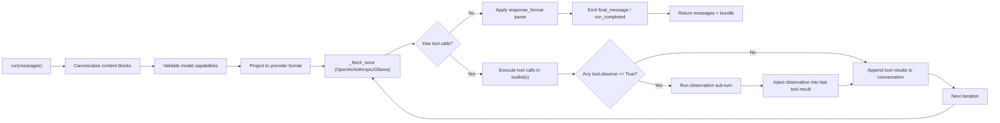

# miso

`miso` 是一个轻量的 Python Agent Builder，核心目标是把“多轮工具调用代理”拆成可组合的最小部件：

- 一个主循环引擎：`broth`
- 一套工具抽象：`tool` / `toolkit`
- 一个结构化输出层：`response_format`
- 一个多模态输入规范层：`media` + canonical content blocks
- 一个远程工具桥接层：`mcp`
- 一个可直接落地的工作区工具包：`python_workspace_toolkit`

它支持 OpenAI / Anthropic / Ollama 三类 provider，并且尽量保持接口一致。

---

## 目录

1. [快速开始](#快速开始)
2. [组件总览（按代码模块）](#组件总览按代码模块)
3. [分层架构与流层逻辑](#分层架构与流层逻辑)
4. [`broth` 主循环详解](#broth-主循环详解)
5. [工具系统（`tool` / `toolkit`）](#工具系统tool--toolkit)
6. [多模态输入规范（canonical blocks）](#多模态输入规范canonical-blocks)
7. [`response_format` 结构化输出](#response_format-结构化输出)
8. [内置工具包：`python_workspace_toolkit`](#内置工具包python_workspace_toolkit)
9. [MCP 工具桥接：`mcp`](#mcp-工具桥接mcp)
10. [配置层：模型默认参数与能力矩阵](#配置层模型默认参数与能力矩阵)
11. [回调事件与可观测性](#回调事件与可观测性)
12. [Provider 差异对照](#provider-差异对照)
13. [典型端到端示例](#典型端到端示例)
14. [项目结构](#项目结构)
15. [测试](#测试)
16. [边界与注意事项](#边界与注意事项)

---

## 快速开始

```bash
python3 -m venv venv
source venv/bin/activate
pip install -r requirements.txt
./run_tests.sh
```

最小调用（OpenAI）：

```python
from miso import broth as Broth

agent = Broth(provider="openai", model="gpt-5", api_key="YOUR_OPENAI_API_KEY")
messages = [{"role": "user", "content": "只回复 OK"}]
messages_out, bundle = agent.run(messages=messages, max_iterations=1)

print(messages_out[-1])
print(bundle)
```

---

## 对外 API（`miso/__init__.py`）

当前包导出的主要符号：

- `broth`：主入口类
- `tool_parameter` / `tool` / `toolkit` / `tool_decorator`
- `response_format`
- `media`
- `mcp`
- `builtin_toolkit`（内置 toolkit 基类）
- `build_builtin_toolkit`（返回 `python_workspace_toolkit` 的 helper）
- `python_workspace_toolkit`

---

## 组件总览（按代码模块）

| 模块 | 核心对象 | 职责 |
|---|---|---|
| `miso/broth.py` | `broth` | 代理主循环、provider 适配、工具调用闭环、token 统计、回调事件 |
| `miso/tool.py` | `tool_parameter` / `tool` / `toolkit` | 工具 schema 推断、工具注册、工具执行 |
| `miso/response_format.py` | `response_format` | JSON Schema 输出约束与解析 |
| `miso/media.py` | `from_file` / `from_url` | 生成 canonical 多模态输入块 |
| `miso/mcp.py` | `mcp(toolkit)` | 把 MCP Server 暴露成 miso toolkit |
| `miso/builtin_toolkits/base.py` | `builtin_toolkit` | 工作区路径安全基类 |
| `miso/builtin_toolkits/python_workspace_toolkit/` | `python_workspace_toolkit` | 文件、目录、行级编辑、隔离 Python runtime |
| `miso/model_default_payloads.json` | - | 不同模型默认 payload |
| `miso/model_capabilities.json` | - | 不同模型能力矩阵（tools、多模态、payload 白名单等） |

统一导出位于 `miso/__init__.py`，你通常会直接 `from miso import ...` 使用。

---

## 分层架构与流层逻辑

`miso` 的核心不是“单次问答”，而是“一个可迭代的代理流”。  
可以把它看成 8 层：

1. **调用层**：`broth.run(messages, payload, ...)`
2. **标准化层**：把输入消息转成 canonical blocks（text/image/pdf）
3. **能力校验层**：根据模型能力矩阵校验模态与 source.type
4. **Provider 投影层**：canonical -> provider 原生请求格式
5. **LLM 回合层**：`_fetch_once` 拉取一轮输出（流式）
6. **工具执行层**：提取 tool calls -> 执行 toolkit -> 生成 tool result message
7. **观察层（可选）**：若工具标记 `observe=True`，触发一次“工具结果复核”
8. **收敛层**：无 tool call 时应用 `response_format`，输出最终消息和 bundle

### 单次 `run()` 时序图



---

## `broth` 主循环详解

### 1) 核心状态

`broth` 在实例上维护了这些关键状态：

- `provider` / `model` / `api_key`
- `toolkits`: 可注册多个 toolkit
- `last_response_id`: OpenAI 最近一次 response id（支持链式 `previous_response_id`）
- `last_reasoning_items`: OpenAI 最近一轮 reasoning blocks
- `last_consumed_tokens`: 最近一次 run 的 token 总消耗
- `consumed_tokens`: 当前实例累计 token 消耗（跨多次 run）
- `_file_id_cache` / `_file_id_reverse`: OpenAI PDF 上传缓存（base64 hash <-> file_id）

### 2) 工具集组合规则

- 通过 `agent.add_toolkit(tk)` 可追加多个 toolkit
- `agent.toolkit` 属性返回“合并视图”
- 同名工具冲突时，**后注册 toolkit 覆盖前者**（last wins）

### 3) `run()` 迭代逻辑

`run()` 的核心行为：

1. 复制输入消息
2. canonicalize（兼容 provider 原生 block）
3. 能力校验（多模态、source.type）
4. provider 投影
5. 进入迭代（默认最多 `self.max_iterations=6`）
6. 每轮调用 `_fetch_once` 获取 assistant 输出
7. 若有 tool call，执行工具并回填 tool result message
8. 若本批工具中任意工具 `observe=True`，触发一次 observation 子回合，并把 observation 注入“最后一个工具结果”
9. 若无 tool call，进入收敛：应用 `response_format.parse` 并返回

若到达 `max_iterations` 仍未收敛，会触发 `run_max_iterations` 事件并返回当前对话。

### 4) token / 上下文窗口统计

返回 `bundle` 结构：

- `consumed_tokens`: 本次 run 累计 token
- `max_context_window_tokens`: 从模型能力矩阵读取（可手动 override）
- `context_window_used_pct`: 用“最后一轮 token 消耗 / max_context_window_tokens”计算

### 5) OpenAI 特殊逻辑

- 强制流式：`stream=True`
- 支持 `previous_response_id`（前提是模型能力允许）
- 支持 reasoning items 提取与事件回调
- PDF base64 在有 `api_key` 时会走 Files API 上传并缓存 `file_id`
- 若 API 返回 stale file_id（NotFound），会自动清缓存并重投影后重试一次

### 6) Anthropic 特殊逻辑

- 使用 `client.messages.stream(...)`
- 从流事件中拼接 `text_delta` 与 `input_json_delta`
- 解析 `tool_use` block 形成 `ToolCall`
- 消耗 token 通过 message start/delta usage 累积

### 7) Ollama 特殊逻辑

- 请求 `POST http://localhost:11434/api/chat`
- 强制流式
- tool schema 会转换成 Ollama 接受的 function 格式
- **仅支持文本输入**，image/pdf 会在前置校验阶段报错

---

## 工具系统（`tool` / `toolkit`）

### `tool_parameter`

定义参数元信息：

- `name`
- `description`
- `type_`（JSON schema primitive）
- `required`
- `pattern`（可选）

### `tool`

`tool` 既可直接包裹函数，也可作为装饰器：

```python
from miso import tool

@tool
def add(a: int, b: int = 2):
    """Add two integers.

    Args:
        a: first
        b: second
    """
    return a + b
```

能力要点：

- 自动从函数签名推断参数类型（`int -> integer`, `list -> array` 等）
- 自动从 docstring 提取 summary 与参数描述（支持 reST / Google 风格）
- `execute()` 支持 `dict` / JSON 字符串参数
- 函数返回值若不是 `dict`，会被包装成 `{"result": ...}`
- 工具异常会包装成 `{"error": "...", "tool": tool_name}`

### `toolkit`

`toolkit` 是工具容器：

- `register` / `register_many`
- `tool()` 装饰器风格注册
- `execute(name, arguments)`
- `to_json()` 输出 provider 可消费的工具 schema 列表

---

## 多模态输入规范（canonical blocks）

`miso` 在用户侧推荐统一格式：

```python
{
  "role": "user",
  "content": [
    {"type": "text", "text": "..."},
    {"type": "image", "source": {"type": "url|base64", ...}},
    {"type": "pdf", "source": {"type": "url|base64|file_id", ...}}
  ]
}
```

### `media` 辅助函数

```python
from miso import media

img = media.from_file("assets/miso_logo.png")
pdf = media.from_file("assets/demo_input.pdf")
url_img = media.from_url("https://example.com/cat.jpg")
```

- `from_file` 支持：`.png/.jpg/.jpeg/.gif/.webp/.pdf`
- 本地文件会转 base64 canonical block
- `from_url` 目前是图片 URL 辅助

### Provider 原生 block 兼容

`broth` 也能接收并 canonicalize 以下原生格式：

- OpenAI：`input_text` / `input_image` / `input_file`
- Anthropic：`text` / `image` / `document`

---

## `response_format` 结构化输出

`response_format` 用 JSON Schema 描述最终输出结构，并在 `run()` 收敛后做 parse 与标准化。

```python
from miso import response_format

fmt = response_format(
    name="answer_format",
    schema={
        "type": "object",
        "properties": {"answer": {"type": "string"}},
        "required": ["answer"],
        "additionalProperties": False,
    },
)
```

行为细节：

- OpenAI：会把 schema 传给 `responses.create(response_format=...)`
- Ollama：会把 schema 放进 `format`
- Anthropic：当前 `broth` 未自动注入 schema 指令，但最终仍会对最后 assistant 文本做 `parse`
- `parse` 失败会抛异常（例如缺少 required 字段或不是合法 JSON）

---

## 内置工具包：`python_workspace_toolkit`

入口：

```python
from miso import python_workspace_toolkit, build_builtin_toolkit

tk = python_workspace_toolkit(
    workspace_root=".",
    include_python_runtime=True,
    include_terminal_runtime=True,
    terminal_strict_mode=True,
)

# 等价 helper
tk2 = build_builtin_toolkit(
    workspace_root=".",
    include_python_runtime=True,
    include_terminal_runtime=True,
    terminal_strict_mode=True,
)
```

### 1) 路径安全

所有路径都会经过 `_resolve_workspace_path()`：

1. 相对路径相对 `workspace_root` 解析
2. 解析符号链接
3. 若路径逃逸 `workspace_root`，直接报错

### 2) 工具清单

文件级：

- `read_file`
- `write_file`
- `create_file`
- `delete_file`
- `copy_file`
- `move_file`
- `file_exists`

目录级：

- `list_directory`
- `create_directory`
- `search_text`（`observe=True`）

行级编辑（1-based 行号）：

- `read_lines`
- `insert_lines`
- `replace_lines`
- `delete_lines`
- `copy_lines`
- `move_lines`
- `search_and_replace`

Python 隔离运行时（`.miso_python_runtime`）：

- `python_runtime_init`
- `python_runtime_install`（`observe=True`）
- `python_runtime_run`（`observe=True`）
- `python_runtime_reset`

Terminal 运行时（受限 shell）：

- `terminal_exec`
- `terminal_session_open`
- `terminal_session_write`
- `terminal_session_close`

---

## MCP 工具桥接：`mcp`

`mcp` 类继承自 `toolkit`，可以把 MCP Server 的工具注册成 miso 可调用工具。

支持三种 transport：

- `stdio`（本地子进程）
- `sse`
- `streamable_http`

示例：

```python
from miso import broth as Broth, mcp

with mcp(command="npx", args=["-y", "@modelcontextprotocol/server-filesystem", "/tmp"]) as server:
    agent = Broth(provider="openai", model="gpt-5", api_key="YOUR_OPENAI_API_KEY")
    agent.add_toolkit(server)
    messages_out, bundle = agent.run(
        messages=[{"role": "user", "content": "列出 /tmp 下的文件"}],
        max_iterations=4,
    )
```

连接后会：

1. `list_tools()` 拉取 MCP 工具定义
2. 转换为 miso `tool` schema
3. 在 `execute()` 中把调用转发到 `call_tool()`
4. 结果统一转成 dict（优先 structuredContent）

---

## 配置层：模型默认参数与能力矩阵

### `model_default_payloads.json`

用于定义模型默认 payload，比如：

- OpenAI: `max_output_tokens` / `truncation` / `reasoning` 等
- Ollama: `num_predict` / `temperature` / `top_p`
- Anthropic: `max_tokens` / `temperature` / `top_p`

### `model_capabilities.json`

用于定义模型能力：

- `supports_tools`
- `supports_response_format`
- `supports_previous_response_id`
- `supports_reasoning`
- `input_modalities`
- `input_source_types`
- `allowed_payload_keys`
- `max_context_window_tokens`

### payload 合并规则（非常关键）

`_merged_payload(payload)` 的规则是：

1. 先拿模型默认 payload
2. 只允许用户覆盖“默认里已存在”的 key
3. 用户新增但默认不存在的 key 会被忽略
4. 最后再按 `allowed_payload_keys` 白名单过滤
5. Anthropic 特殊处理：`temperature` 与 `top_p` 二选一（避免冲突）

模型名解析支持“前缀匹配”和 `.` / `-` 归一化，可兼容带日期后缀的模型名。

---

## 回调事件与可观测性

`run(..., callback=fn)` 会发事件 dict。常见事件：

- `run_started`
- `iteration_started`
- `token_delta`
- `reasoning`
- `tool_call`
- `tool_result`
- `observation`
- `iteration_completed`
- `final_message`
- `run_completed`
- `run_max_iterations`

事件含通用字段：`type`, `run_id`, `iteration`, `timestamp`，并附带上下文字段（如 `delta`, `tool_name`, `result`）。

---

## Provider 差异对照

| 维度 | OpenAI | Anthropic | Ollama |
|---|---|---|---|
| 主要调用接口 | `OpenAI.responses.create` | `Anthropic.messages.stream` | `http://localhost:11434/api/chat` |
| 是否强制流式 | 是 | 使用 stream API | 是 |
| 多模态输入 | text/image/pdf | text/image/pdf | text only |
| 工具调用 | function_call | tool_use | tool_calls |
| `previous_response_id` | 支持（能力矩阵允许时） | 不支持 | 不支持 |
| 结构化输出透传 | `response_format` | 当前未透传（本地 parse） | `format` |
| PDF base64 处理 | 可上传 Files API 并缓存 file_id | 直接 document/base64 | 不支持 |

---

## 典型端到端示例

### 1) 自定义工具 + 主循环

```python
from miso import broth as Broth, tool, toolkit

@tool
def add(a: int, b: int = 2):
    """Add two integers."""
    return a + b

tk = toolkit()
tk.register(add, observe=True)

agent = Broth(provider="openai", model="gpt-5", api_key="YOUR_OPENAI_API_KEY")
agent.toolkit = tk

messages, bundle = agent.run(
    messages=[{"role": "user", "content": "调用 add(a=5) 并告诉我结果"}],
    max_iterations=4,
)
```

### 2) 内置工作区工具 + 隔离 runtime

```python
from miso import broth as Broth, python_workspace_toolkit

agent = Broth(provider="openai", model="gpt-5", api_key="YOUR_OPENAI_API_KEY")
agent.add_toolkit(
    python_workspace_toolkit(
        workspace_root=".",
        include_python_runtime=True,
        include_terminal_runtime=True,
        terminal_strict_mode=True,
    )
)

messages, bundle = agent.run(
    messages=[{"role": "user", "content": "创建 demo.py，写入一个 hello 函数并运行它"}],
    max_iterations=6,
)
```

### 3) 多模态输入

```python
from miso import broth as Broth, media

agent = Broth(provider="openai", model="gpt-5", api_key="YOUR_OPENAI_API_KEY")

messages = [{
    "role": "user",
    "content": [
        {"type": "text", "text": "先概述 PDF，再结合图片回答"},
        media.from_file("assets/demo_input.pdf"),
        media.from_file("assets/miso_logo.png"),
    ],
}]

messages_out, bundle = agent.run(messages=messages, max_iterations=1)
```

### 4) 结构化输出

```python
from miso import broth as Broth, response_format

agent = Broth(provider="openai", model="gpt-5", api_key="YOUR_OPENAI_API_KEY")

fmt = response_format(
    name="answer_format",
    schema={
        "type": "object",
        "properties": {
            "answer": {"type": "string"},
            "confidence": {"type": "number"},
        },
        "required": ["answer", "confidence"],
        "additionalProperties": False,
    },
)

messages_out, bundle = agent.run(
    messages=[{"role": "user", "content": "用 JSON 输出答案与置信度"}],
    response_format=fmt,
    max_iterations=1,
)
```

---

## 项目结构

```text
miso/
  __init__.py
  broth.py
  tool.py
  response_format.py
  media.py
  mcp.py
  model_default_payloads.json
  model_capabilities.json
  builtin_toolkits/
    __init__.py
    base.py
    python_workspace_toolkit/
      __init__.py
      python_workspace_toolkit.py
tests/
  test_broth_core.py
  test_toolkit_design.py
  test_builtin_toolkit.py
  test_mcp.py
  test_file_cache.py
  test_openai_family_smoke.py
  test_anthropic_smoke.py
  test_ollama_smoke.py
```

---

## 测试

运行全部测试：

```bash
./run_tests.sh
```

Smoke tests 依赖环境变量：

- OpenAI: `OPENAI_API_KEY`, `OPENAI_MODEL`
- Anthropic: `ANTHROPIC_API_KEY`, `ANTHROPIC_MODEL`
- Ollama: 本地服务 `http://localhost:11434`，可选 `OLLAMA_MODEL`
- MCP smoke: `MCP_SMOKE=1` 且本机可用 `npx`

---

## 边界与注意事项

1. 入口类是 `broth`，不是 `agent`。建议 `from miso import broth as Broth`。
2. Ollama 当前只支持文本输入；image/pdf 会在前置校验阶段抛错。
3. `response_format` 在 Anthropic 路径不会自动注入 schema 指令，主要靠本地 parse 兜底。
4. `observe=True` 触发的是“工具结果复核子回合”，会额外消耗 token。
5. 工具名冲突时以后注册 toolkit 为准，建议在多 toolkit 组合时避免重名。
6. `python_workspace_toolkit` 默认可在工作区内创建/删除/移动文件，生产场景建议最小化 `workspace_root` 范围。

---

如果你准备基于 miso 二次开发，建议优先阅读：

1. `miso/broth.py`（主循环与 provider 适配）
2. `miso/tool.py`（工具抽象）
3. `miso/builtin_toolkits/python_workspace_toolkit/python_workspace_toolkit.py`（可直接落地的工具实现）
