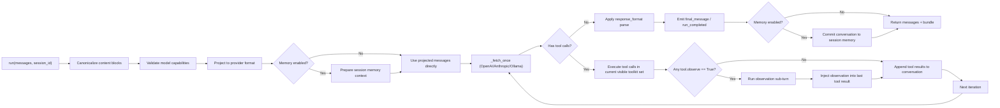

[Back to landing page](../README.md) | [中文文档](README.zh-CN.md)

# miso

`miso` is a lightweight Python agent builder whose core goal is to break "multi-turn tool-using agents" into the smallest composable parts:

- A high-level multi-agent API: `Agent` / `Team`
- A main-loop runtime engine: `broth`
- A session memory layer: `memory` (short-term context window + optional long-term memory)
- A tool abstraction layer: `tool` / `toolkit`
- A structured output layer: `response_format`
- A multimodal input normalization layer: `media` + canonical content blocks
- A remote tool bridge layer: `mcp`
- A toolkit registry layer: `tool_registry` (manifest scanning, metadata, plugin discovery)
- A toolkit catalog layer: `toolkit_catalog` (registry-backed lazy toolkit activation)
- Four built-in toolkits you can use directly: `access_workspace_toolkit` / `run_terminal_toolkit` / `external_api_toolkit` / `ask_user_toolkit`

It supports four provider families, with as much interface consistency as possible: OpenAI / Anthropic / Gemini / Ollama.

---

## Table of Contents

1. [Quick Start](#quick-start)
2. [Public API (`miso/__init__.py`)](#public-api-miso__init__py)
3. [Component Overview (by module)](#component-overview-by-module)
4. [Layered Architecture and Flow Logic](#layered-architecture-and-flow-logic)
5. [`broth` Main Loop Deep Dive](#broth-main-loop-deep-dive)
6. [Session Memory (Context Window Strategy)](#session-memory-context-window-strategy)
7. [Tool System (`tool` / `toolkit`)](#tool-system-tool--toolkit)
8. [Tool Confirmation Callback (`on_tool_confirm`)](#tool-confirmation-callback-on_tool_confirm)
9. [Human Input Primitive (selector)](#human-input-primitive-selector)
10. [Multimodal Input Specification (canonical blocks)](#multimodal-input-specification-canonical-blocks)
11. [Structured Output with `response_format`](#structured-output-with-response_format)
12. [Built-in Toolkit: `access_workspace_toolkit`](#built-in-toolkit-access_workspace_toolkit)
13. [Toolkit Catalog (Lazy Activation)](#toolkit-catalog-lazy-activation)
14. [MCP Toolkit Bridge: `mcp`](#mcp-toolkit-bridge-mcp)
15. [Configuration Layer: Model Default Payloads and Capability Matrix](#configuration-layer-model-default-payloads-and-capability-matrix)
16. [Callback Events and Observability](#callback-events-and-observability)
17. [Provider Comparison](#provider-comparison)
18. [Typical End-to-End Examples](#typical-end-to-end-examples)
19. [Project Structure](#project-structure)
20. [Tests](#tests)
21. [Boundaries and Notes](#boundaries-and-notes)

---

## Quick Start

Development standards:

- The root `.python-version` is fixed to `3.12`
- The only supported development runtime is `Python 3.12.x`
- The only supported development virtual environment directory is `.venv/`
- The old `venv/` layout is no longer supported

Recommended initialization flow:

```bash
./scripts/init_python312_venv.sh
source .venv/bin/activate
./run_tests.sh
```

Windows:

```powershell
powershell -ExecutionPolicy Bypass -File .\scripts\init_python312_venv.ps1
.\.venv\Scripts\Activate.ps1
```

If you need to create the environment manually, it still must use Python `3.12.x`:

```bash
python3.12 -m venv .venv
source .venv/bin/activate
pip install -r requirements.txt
```

```powershell
py -3.12 -m venv .venv
.\.venv\Scripts\Activate.ps1
pip install -r requirements.txt
```

Recommended entrypoint (`Agent` / `Team`):

```python
from miso import Agent, Team

planner = Agent(
    name="planner",
    provider="openai",
    model="gpt-5",
    api_key="YOUR_OPENAI_API_KEY",
    instructions="You plan work and coordinate the team.",
)

reviewer = Agent(
    name="reviewer",
    provider="openai",
    model="gpt-5",
    api_key="YOUR_OPENAI_API_KEY",
    instructions="You review plans and call out risks.",
)

team = Team(
    agents=[planner, reviewer],
    owner="planner",
    channels={"shared": ["planner", "reviewer"]},
)

result = team.run("Give me a minimal viable release plan.")
print(result["final"])
```

Synchronous subagents (runtime tool delegation):

```python
from miso import Agent

coordinator = Agent(
    name="coordinator",
    provider="openai",
    model="gpt-5",
    api_key="YOUR_OPENAI_API_KEY",
    instructions="Coordinate the work and delegate focused research when needed.",
).enable_subagents()

conversation, bundle = coordinator.run(
    "First ask a researcher subagent to investigate release risks, then give me the conclusion."
)

print(conversation[-1]["content"])
print(bundle)
```

After enabling this mode, the agent dynamically registers a `spawn_subagent(task, role, instructions="")` tool on each run. Child agents inherit the parent's model, tools, and memory manager, while running in their own `session_id` / `memory_namespace` branch.

The lower-level runtime (`Broth`) is still available if you want full control over the provider/tool loop:

```python
from miso import broth as Broth

agent = Broth(provider="openai", model="gpt-5", api_key="YOUR_OPENAI_API_KEY")
messages = [{"role": "user", "content": "Reply with OK only"}]
messages_out, bundle = agent.run(messages=messages, max_iterations=1)

print(messages_out[-1])
print(bundle)
```

---

## Public API (`miso/__init__.py`)

The package currently exports these main symbols:

- `Agent` / `Team`: recommended high-level single-agent / multi-agent entrypoints
- `broth`: lower-level runtime engine / compatibility entrypoint
- `MemoryManager` / `MemoryConfig` / `LongTermMemoryConfig`
- `ContextStrategy` / `SessionStore` / `VectorStoreAdapter`
- `LongTermProfileStore` / `LongTermVectorAdapter`
- `LastNTurnsStrategy` / `SummaryTokenStrategy` / `HybridContextStrategy`
- `JsonFileLongTermProfileStore`
- `QdrantLongTermVectorAdapter` / `build_default_long_term_qdrant_vector_adapter`
- `build_openai_embed_fn`
- `tool_parameter` / `tool` / `toolkit` / `tool_decorator`
- `ToolHistoryOptimizationContext` / `NormalizedToolHistoryRecord` / `HistoryPayloadOptimizer`
- `ToolConfirmationRequest` / `ToolConfirmationResponse`
- `HumanInputOption` / `HumanInputRequest` / `HumanInputResponse`
- `response_format`
- `media`
- `mcp`
- `ToolDescriptor` / `ToolkitDescriptor`
- `ToolRegistryConfig` / `ToolkitRegistry` / `ToolkitCatalogConfig`
- `list_toolkits` / `get_toolkit_metadata`
- `builtin_toolkit` (built-in toolkit base class)
- `build_builtin_toolkit` (helper that returns `access_workspace_toolkit`)
- `access_workspace_toolkit`
- `run_terminal_toolkit`
- `external_api_toolkit`
- `ask_user_toolkit`

---

## Component Overview (by module)

| Module | Core objects | Responsibility |
| --- | --- | --- |
| `miso/agent.py` | `Agent` | High-level single-agent API; wraps tools, memory, defaults, and composes `broth` |
| `miso/team.py` | `Team` | Multi-agent orchestration, channel routing, handoff, owner finalization |
| `miso/broth.py` | `broth` | Low-level execution engine: provider adapters, tool loop, token accounting, callback events |
| `miso/memory.py` | `MemoryManager` / strategy protocols | Session memory, deferred tool-history compaction, context window trimming, summaries, optional vector recall |
| `miso/memory_qdrant.py` | `QdrantVectorAdapter` / `QdrantLongTermVectorAdapter` | Qdrant adapters and OpenAI embedding helper |
| `miso/tool.py` | `tool_parameter` / `tool` / `toolkit` | Tool schema inference, registration, execution, optional history-payload optimizers |
| `miso/tool_registry.py` | `ToolkitRegistry` | Toolkit metadata scanning, validation, read-only registry output, instantiation by id |
| `miso/toolkit_catalog.py` | `ToolkitCatalogConfig` / `ToolkitCatalogRuntime` | Lazy activation for registry-backed toolkits, run-scoped activation state, continuation restore |
| `miso/human_input.py` | `HumanInputRequest` / `HumanInputResponse` | Selector request/response protocol and runtime contract |
| `miso/response_format.py` | `response_format` | JSON Schema output constraints and parsing |
| `miso/media.py` | `from_file` / `from_url` | Generate canonical multimodal input blocks |
| `miso/mcp.py` | `mcp(toolkit)` | Expose an MCP server as a `miso` toolkit |
| `miso/workspace_pins.py` | `WorkspacePinExecutionContext` | Session-scoped pinned context injection and live reload |
| `miso/builtin_toolkits/base.py` | `builtin_toolkit` | Workspace-root safety base class |
| `miso/builtin_toolkits/access_workspace_toolkit/` | `access_workspace_toolkit` | File, directory, and line-level editing tools |
| `miso/builtin_toolkits/run_terminal_toolkit/` | `run_terminal_toolkit` | Restricted terminal actions only |
| `miso/builtin_toolkits/external_api_toolkit/` | `external_api_toolkit` | Basic HTTP GET / POST requests |
| `miso/builtin_toolkits/ask_user_toolkit/` | `ask_user_toolkit` | Structured user interaction |
| `miso/model_default_payloads.json` | - | Default payloads per model |
| `miso/model_capabilities.json` | - | Model capability matrix: tools, multimodal inputs, payload allowlists, and more |

Unified exports live in `miso/__init__.py`, so most usage looks like `from miso import ...`.

---

## Layered Architecture and Flow Logic

The core of `miso` is not "single-turn Q&A", but an iterative agent flow.  
The recommended external entrypoints are `Agent` / `Team`, and the underlying execution engine is `broth`.  
You can think of it as 11 layers:

1. **Entrypoint layer**: `Agent.run(...)` / `Agent.step(...)` / `Team.run(...)` / `broth.run(...)`
2. **Normalization layer**: convert input messages into canonical blocks (`text` / `image` / `pdf`)
3. **Capability validation layer**: validate modalities and `source.type` against the model capability matrix
4. **Provider projection layer**: canonical blocks -> provider-native request format
5. **Memory preprocessing layer (optional)**: merge history by `session_id` and apply a strategy (summary / last-n / vector recall)
6. **LLM turn layer**: `_fetch_once` retrieves one round of output (streaming)
7. **Tool execution layer**: extract tool calls -> execute within the currently visible toolkit set -> generate tool result messages
8. **Observation layer (optional)**: if a tool is marked `observe=True`, trigger one extra "tool result review" turn
9. **Convergence layer**: if there are no tool calls, apply `response_format` and produce the final message and bundle
10. **Memory commit layer (optional)**: write the final conversation back to the session store and optionally into a vector index
11. **Orchestration layer (`Team`)**: named channels, scheduling, handoff, owner finalization

### Single `run()` sequence diagram



---

## `broth` Main Loop Deep Dive

`broth` is the lower-level runtime engine.  
Even if you use `Agent` / `Team`, execution eventually reaches this layer.  
If you want full manual control over the provider/tool loop, you can keep using `broth` directly.

### 1) Core state

`broth` keeps these important pieces of state on the instance:

- `provider` / `model` / `api_key`
- `memory_manager`: optional session memory manager
- `toolkits`: multiple toolkits can be registered
- `last_response_id`: the latest OpenAI response id (supports chaining via `previous_response_id`)
- `last_reasoning_items`: reasoning blocks from the latest OpenAI round
- `last_consumed_tokens`: total token cost for the latest run
- `consumed_tokens`: cumulative token cost for the instance (across multiple runs)
- `_file_id_cache` / `_file_id_reverse`: OpenAI PDF upload cache (`base64 hash <-> file_id`)

### 2) Toolkit composition rules

- Use `agent.add_toolkit(tk)` to append multiple toolkits
- The `agent.toolkit` property returns a merged view
- If two tools share the same name, the **later registered toolkit overrides the earlier one** (`last wins`)

### 3) `run()` iteration logic

The core `run()` behavior is:

1. Copy input messages
2. Canonicalize content (including provider-native blocks)
3. Validate capabilities (multimodal inputs, `source.type`)
4. Project into provider format
5. If `memory_manager` is configured and `session_id` is provided, run memory preparation (merge history + trim/summarize)
6. Enter the iteration loop (default max is `self.max_iterations=6`)
7. Each round calls `_fetch_once` to get assistant output
8. If tool calls exist, execute the tools and append tool result messages
9. If any tool in the batch has `observe=True`, trigger one observation sub-turn and inject the observation into the **last tool result**
10. If there are no tool calls, enter convergence and apply `response_format.parse`
11. Before returning (including the `run_max_iterations` path), commit session memory if enabled

If the loop reaches `max_iterations` without convergence, `run_max_iterations` is emitted and the current conversation is returned.

### 4) Token / context window accounting

Returned `bundle` fields:

- `model`: model name used for this run
- `consumed_tokens`: total tokens consumed during this run
- `max_context_window_tokens`: read from the model capability matrix (can be overridden manually)
- `context_window_used_pct`: computed as "last-round token cost / max_context_window_tokens"

### 4.1) Additional key parameters

- `Broth(..., memory_manager=...)`: enable pluggable session memory
- `run(..., session_id="...")`: bind the request to a session; without it, old behavior remains unchanged
- OpenAI `previous_response_id` logic stays the same; memory only affects request preparation and session commit

### 5) OpenAI-specific logic

- Streaming is forced: `stream=True`
- Supports `previous_response_id` when model capabilities allow it
- Supports reasoning item extraction and callback events
- PDF base64 payloads are uploaded through the Files API and cached as `file_id` when `api_key` is available
- If the API returns a stale `file_id` (`NotFound`), the cache is cleared and the request is reprojected once

### 6) Anthropic-specific logic

- Uses `client.messages.stream(...)`
- Reconstructs `text_delta` and `input_json_delta` from stream events
- Parses `tool_use` blocks into `ToolCall`
- Token usage is accumulated from message start/delta usage events

### 7) Ollama-specific logic

- Sends `POST http://localhost:11434/api/chat`
- Streaming is forced
- Tool schemas are converted into the function format Ollama accepts
- **Only text input is supported**; image/pdf inputs fail during pre-validation

---

## Session Memory (Context Window Strategy)

`miso` memory is built into classes, not implemented as a tool call chain.  
The main entrypoint is `MemoryManager`, and the default strategy is `HybridContextStrategy(summary + last-n)`.

### 1) Minimal enablement example

```python
from miso import broth as Broth
from miso import MemoryManager, MemoryConfig

memory = MemoryManager(
    config=MemoryConfig(
        last_n_turns=8,
        summary_trigger_pct=0.75,
        summary_target_pct=0.45,
    )
)

agent = Broth(
    provider="openai",
    model="gpt-5",
    api_key="YOUR_OPENAI_API_KEY",
    memory_manager=memory,
)

messages, bundle = agent.run(
    messages=[{"role": "user", "content": "Continue the previous topic"}],
    session_id="demo-session-1",
)
```

### 2) Default strategy behavior

- Token estimate: `estimated_tokens = ceil(chars / 4)`
- Trigger condition: estimated usage exceeds `summary_trigger_pct`
- Compression target: move closer to `summary_target_pct`
- Trimming rule: keep all `system` messages + the latest `last_n_turns` turns
- Deferred tool compaction runs before summary / last-n: the newest completed turn and the current turn stay raw, while older tool arguments/results can be compacted for the next run
- Failure fallback: summary or vector failures do not interrupt the main flow; they automatically fall back and continue

### 3) Deferred tool compaction

`MemoryManager.prepare_messages(...)` can compact old tool payloads without mutating the stored raw session transcript:

- The full conversation is still written back during `commit_messages(...)`
- The next `prepare_messages(...)` call builds a compacted view from that raw history
- Compaction is provider-aware internally (`OpenAI` / `Anthropic` / `Gemini` / `Ollama`), but tools only receive normalized payloads
- By default, only older turns are compacted; the latest completed turn is left untouched so the model can still reason over the freshest tool output in full

Relevant `MemoryConfig` knobs:

- `deferred_tool_compaction_enabled`
- `deferred_tool_compaction_keep_completed_turns`
- `deferred_tool_compaction_max_chars`
- `deferred_tool_compaction_preview_chars`
- `deferred_tool_compaction_include_tools`
- `deferred_tool_compaction_hash_payloads`

### 4) Strategy and extension interfaces

- `SessionStore`: `load(session_id) / save(session_id, state)`
- `ContextStrategy`: `prepare(...) / commit(...)`
- `VectorStoreAdapter`: `add_texts(...) / similarity_search(...)`
- Default store: `InMemorySessionStore` (in-process only)
- Default strategy: `HybridContextStrategy` (internally combines `SummaryTokenStrategy + LastNTurnsStrategy`)

### 5) Custom vector adapter example

```python
from miso import MemoryManager, MemoryConfig

class MyVectorAdapter:
    def add_texts(self, *, session_id, texts, metadatas):
        ...

    def similarity_search(self, *, session_id, query, k, min_score=None):
        # Supports two return shapes:
        # 1) list[str]
        # 2) list[{
        #      "text": "...",
        #      "messages": [{"role": "user|assistant", "content": "..."}]
        #    }]
        return []

memory = MemoryManager(
    config=MemoryConfig(
        vector_adapter=MyVectorAdapter(),
        vector_top_k=4,
        vector_min_score=0.75,  # optional
    )
)
```

### 6) OpenAI embedding factory (built-in config lookup)

`miso.memory_qdrant.build_openai_embed_fn(...)` builds an embedding function from the project's JSON config:

- Capability config: `miso/model_capabilities.json`
- Default payload config: `miso/model_default_payloads.json`
- API key priority: `broth.api_key` -> `OPENAI_API_KEY`

```python
from miso import MemoryManager, MemoryConfig, build_openai_embed_fn
from miso.memory_qdrant import QdrantVectorAdapter
from qdrant_client import QdrantClient

embed_fn, vector_size = build_openai_embed_fn(
    model="text-embedding-3-small",
    broth_instance=agent,  # optional; reads agent.api_key first
    payload={"encoding_format": "float"},
)

vector_adapter = QdrantVectorAdapter(
    client=QdrantClient(path="/tmp/qdrant"),
    embed_fn=embed_fn,
    vector_size=vector_size,
)

memory = MemoryManager(
    config=MemoryConfig(
        vector_adapter=vector_adapter,
        vector_top_k=4,
        vector_min_score=0.75,  # optional
    )
)
```

### 7) How recall is generated

Recall comes from the `VectorStoreAdapter` you inject. The flow is:

1. During `commit_messages(...)`, memory incrementally stores complete turns (`user -> assistant`).
   - The embedding text format for each turn is: `user: ...\\nassistant: ...`
   - Metadata carries `messages` (user/assistant only) plus `turn_start_index` / `turn_end_index`
   - An incomplete trailing turn is not stored early; it is completed automatically on a later commit
2. During the next `prepare_messages(...)`, memory uses the latest user message as the query and calls `similarity_search(session_id, query, k, min_score=None)`.
3. If results are returned, they are injected as a `system` message in this format:
   - First line is a fixed marker: `[Recall messages]`
   - Starting from the second line: a strict JSON message array string (`[{"role":"user|assistant","content":"..."}]`)
   - If a hit contains `messages`, those are preferred
   - Older formats (`list[str]` / `{"text","role"}`) are still supported and fallback role inference is applied
4. If `vector_min_score` is configured, the adapter should only return hits at or above that threshold; long-term retrieval follows the same pattern with `vector_min_score` / `episode_min_score` / `playbook_min_score`.
5. If no adapter is configured, there is no user query, retrieval errors, or the result is empty, recall is skipped without affecting the main flow.

Notes:

- `miso` itself does not ship an embedding or vector database implementation; your adapter decides that.
- Recall content is optional additional context and never overrides the original session messages.

### 8) Event observability

When memory is enabled, callbacks receive extra events:

- `memory_prepare`: whether memory was applied, estimated tokens before/after trimming, summary/vector fallback reasons, and so on
- `memory_commit`: session writeback result, stored message count, optional vector indexing result
- `memory_prepare` may also include deferred compaction fields such as `deferred_compaction_applied`, `deferred_compaction_turns_compacted`, and `deferred_compaction_bytes_removed_estimate`

---

## Tool System (`tool` / `toolkit`)

### `tool_parameter`

Defines parameter metadata:

- `name`
- `description`
- `type_` (JSON Schema primitive)
- `required`
- `pattern` (optional)

### `tool`

`tool` can be used either as a direct wrapper or as a decorator:

```python
from miso import tool

@tool
def add(a: int, b: int = 2):
    """Add two integers.

    Args:
        a: first
        b: second
    """
    return a + b
```

Key capabilities:

- Automatically infers parameter types from the function signature (`int -> integer`, `list -> array`, and so on)
- Automatically extracts summary and parameter descriptions from docstrings (supports reST / Google style)
- `execute()` accepts both `dict` and JSON-string arguments
- Non-`dict` function returns are wrapped as `{"result": ...}`
- Tool exceptions are wrapped as `{"error": "...", "tool": tool_name}`
- `observe=True` marks a tool for a post-execution "result review" sub-turn
- `requires_confirmation=True` marks a tool as needing user confirmation before execution (see [Tool Confirmation Callback](#tool-confirmation-callback-on_tool_confirm))
- Tools can optionally provide `history_arguments_optimizer` and `history_result_optimizer` hooks for deferred memory compaction

Example:

```python
from miso import tool

def compact_old_args(payload, context):
    return {
        "compacted": True,
        "tool": context.tool_name,
        "kind": context.kind,
    }

archive_tool = tool(
    name="archive_blob",
    func=lambda path: {"ok": True},
    history_arguments_optimizer=compact_old_args,
)
```

The optimizer hook only runs during deferred compaction. It does not change the tool's live execution result in the current turn.

### `toolkit`

`toolkit` is a tool container:

- `register` / `register_many`
- Decorator-style registration via `tool()`
- `execute(name, arguments)`
- `to_json()` to emit a list of provider-consumable tool schemas
- `shutdown()` lifecycle hook (default no-op; useful for cleaning up runtime resources)

If the registry contains many toolkits, you do not need to expose all of them to the model at the start of every run. You can enable Toolkit Catalog mode later in this document, letting the model inspect summaries / READMEs first and activate concrete toolkits only when needed.

---

## Tool Confirmation Callback (`on_tool_confirm`)

Some tools, such as deleting files or executing shell commands, should require user confirmation before execution. `miso` provides per-tool confirmation support.

### Mark tools as requiring confirmation

Set `requires_confirmation=True` when defining or registering a tool (default is `False`):

```python
from miso import tool, toolkit

# Option 1: direct constructor
dangerous = tool(name="delete_file", func=delete_fn, requires_confirmation=True)

# Option 2: decorator
@tool(requires_confirmation=True)
def rm_rf(path: str):
    """Delete everything."""
    ...

# Option 3: override during toolkit registration
tk = toolkit()
tk.register(some_func, requires_confirmation=True)

# Option 4: toolkit decorator
@tk.tool(requires_confirmation=True)
def drop_database():
    ...
```

### Provide a confirmation callback

Pass a callback via `on_tool_confirm`. There are two entrypoints, and **run-level overrides instance-level**:

```python
from miso import broth as Broth

agent = Broth(provider="openai", model="gpt-5", api_key="...")

# Instance-level default (shared across runs)
agent.on_tool_confirm = my_confirm_handler

# Run-level override (only for this run)
agent.run(messages=..., on_tool_confirm=my_confirm_handler)
```

### Callback signature and return values

The callback receives a `ToolConfirmationRequest`, and the return value is polymorphic:

```python
from miso import ToolConfirmationRequest, ToolConfirmationResponse

# Simplest form: return bool
def confirm(req: ToolConfirmationRequest) -> bool:
    return input(f"Allow '{req.tool_name}'? (y/n): ").lower() == "y"

# Deny with a reason
def confirm_deny(req):
    return {"approved": False, "reason": "Not allowed in production"}

# Sanitize arguments before approval
def confirm_sanitize(req):
    sanitized = {**req.arguments, "force": False}
    return {"approved": True, "modified_arguments": sanitized}

# Return the full object
def confirm_obj(req):
    return ToolConfirmationResponse(approved=True, reason="ok")
```

**`ToolConfirmationRequest` fields:**

| Field | Type | Description |
| --- | --- | --- |
| `tool_name` | `str` | Tool name |
| `call_id` | `str` | Unique id for this tool call |
| `arguments` | `dict` | Arguments passed by the LLM |
| `description` | `str` | Tool description text |

**`ToolConfirmationResponse` fields:**

| Field | Type | Default | Description |
| --- | --- | --- | --- |
| `approved` | `bool` | `True` | Whether execution is approved |
| `modified_arguments` | `dict \| None` | `None` | Optional argument rewrite when approving |
| `reason` | `str` | `""` | Optional denial reason |

### Execution flow

```text
tool.requires_confirmation?  ──No──→  Execute directly (existing path)
        │ Yes
        ▼
on_tool_confirm exists?  ──No──→  Execute directly (backward compatible; never blocks forever)
        │ Yes
        ▼
Call on_tool_confirm(ToolConfirmationRequest)
        │
        ├─ returns True / {"approved": True}  →  Execute, emit "tool_confirmed"
        ├─ returns {"approved": True, "modified_arguments": {...}}  →  Execute with new args
        └─ returns False / {"approved": False}  →  Do not execute, emit "tool_denied"
                                                  Return {"denied": True, ...} to the LLM
```

Key design principles:

- **opt-in**: tools not marked `requires_confirmation` are completely unaffected
- **no callback, no blocking**: if a tool is marked but no callback is provided, it is auto-approved to avoid deadlocks
- **automatic MCP mapping**: MCP tools with `annotations.destructiveHint = true` are automatically marked `requires_confirmation=True`

---

## Human Input Primitive (selector)

When the model needs the user to pick one or more options instead of continuing to guess, you can explicitly attach `ask_user_toolkit()`. It exposes a reserved tool: `request_user_input`.

The difference from `on_tool_confirm` is:

- `on_tool_confirm` is about "whether a tool execution is allowed"
- `ask_user_toolkit` / `request_user_input` is about "ask the user a structured question and wait for an answer"

### Public types

`miso/__init__.py` exports:

- `HumanInputOption`
- `HumanInputRequest`
- `HumanInputResponse`

Selector v1 supports:

- Single select: `selection_mode="single"`
- Multi-select: `selection_mode="multiple"`
- When `allow_other=True`, show `Other`
- `__other__` is a reserved value and requires `other_text` on submit

### Runtime behavior

Prerequisites:

- You must explicitly attach `ask_user_toolkit()`
- The current model must support tool calling
- The current version does not support a non-tool fallback

When the model calls `request_user_input`:

1. `run()` does not continue through the normal tool flow
2. The returned bundle contains:
   - `status="awaiting_human_input"`
   - `human_input_request`
   - `continuation`
3. A `human_input_requested` callback event is emitted
4. A normal `tool_result` is not generated
5. `memory_commit` is not triggered while the run is suspended

The host / frontend is responsible for rendering the selector and storing the `continuation`. Once the user responds, call `resume_human_input(...)` to continue the same session.

### `run()` / `resume_human_input()` example

```python
from miso import broth as Broth, ask_user_toolkit

agent = Broth(provider="openai", model="gpt-5", api_key="YOUR_OPENAI_API_KEY")
agent.add_toolkit(ask_user_toolkit())

messages, bundle = agent.run(
    messages=[{"role": "user", "content": "Help me pick a frontend framework. If you are unsure, ask me directly."}],
    session_id="selector-demo",
    payload={"store": True},
    max_iterations=4,
)

if bundle["status"] == "awaiting_human_input":
    request = bundle["human_input_request"]
    # Render request["title"] / request["question"] / request["options"] in your UI

    messages, bundle = agent.resume_human_input(
        conversation=messages,
        continuation=bundle["continuation"],
        response={
            "request_id": request["request_id"],
            "selected_values": ["react", "__other__"],
            "other_text": "SolidJS",
        },
        session_id="selector-demo",
    )
```

### Selector constraints

- In v1, `request_user_input` must be the only tool call in that iteration
- `single` defaults to `min_selected=1`, `max_selected=1`
- `multiple` defaults to `min_selected=1`
- `Other` can only be submitted when `allow_other=True`
- Selecting `__other__` requires a non-empty `other_text`
- Without `ask_user_toolkit()`, this capability is not enabled automatically
- If `supports_tools=false` for the model, `run()` fails directly rather than silently degrading

---

## Multimodal Input Specification (canonical blocks)

Recommended unified user-side format in `miso`:

```python
{
  "role": "user",
  "content": [
    {"type": "text", "text": "..."},
    {"type": "image", "source": {"type": "url|base64", ...}},
    {"type": "pdf", "source": {"type": "url|base64|file_id", ...}}
  ]
}
```

### `media` helpers

```python
from miso import media

img = media.from_file("assets/miso_logo.png")
pdf = media.from_file("assets/demo_input.pdf")
url_img = media.from_url("https://example.com/cat.jpg")
```

- `from_file` supports `.png/.jpg/.jpeg/.gif/.webp/.pdf`
- Local files are converted to base64 canonical blocks
- `from_url` is currently a helper for image URLs

### Provider-native block compatibility

`broth` can also receive and canonicalize these native formats:

- OpenAI: `input_text` / `input_image` / `input_file`
- Anthropic: `text` / `image` / `document`

---

## Structured Output with `response_format`

`response_format` uses JSON Schema to describe the final output shape, then parses and normalizes the final response after convergence.

```python
from miso import response_format

fmt = response_format(
    name="answer_format",
    schema={
        "type": "object",
        "properties": {"answer": {"type": "string"}},
        "required": ["answer"],
        "additionalProperties": False,
    },
)
```

Behavior details:

- OpenAI: passes the schema into `responses.create(response_format=...)`
- Ollama: puts the schema into `format`
- Anthropic: `broth` does not currently inject schema instructions automatically, but still parses the final assistant text locally
- `parse` failures raise exceptions (for example, missing required fields or invalid JSON)

---

## Built-in Toolkit: `access_workspace_toolkit`

Entrypoint:

```python
from miso import access_workspace_toolkit, build_builtin_toolkit

tk = access_workspace_toolkit(workspace_root=".")

# Equivalent helper
tk2 = build_builtin_toolkit(workspace_root=".")
```

### 1) Path safety

All paths go through `_resolve_workspace_path()`:

1. Relative paths are resolved against `workspace_root`
2. Symlinks are resolved
3. If the path escapes `workspace_root`, execution fails immediately

### 2) Tool list

File-level:

- `read_file`
- `write_file`
- `create_file`
- `delete_file`
- `copy_file`
- `move_file`
- `file_exists`

Directory-level:

- `list_directory`
- `create_directory`
- `search_text` (`observe=True`)

`read_file`, `write_file`, and `create_file` also ship with built-in history optimizers:

- old `read_file` history keeps `path`, line metadata, and a short content preview
- old `write_file` / `create_file` history replaces large `content` payloads with a compact blob summary

Line-level editing (1-based line numbers):

- `read_lines`
- `insert_lines`
- `replace_lines`
- `delete_lines`
- `copy_lines`
- `move_lines`
- `search_and_replace`

### 3) If you need terminal actions

```python
from miso import run_terminal_toolkit

term_tk = run_terminal_toolkit(
    workspace_root=".",
    terminal_strict_mode=True,
)
```

`run_terminal_toolkit` only registers these tools:

- `terminal_exec`
- `terminal_session_open`
- `terminal_session_write`
- `terminal_session_close`

---

## Toolkit Catalog (Lazy Activation)

As the number of registry-backed toolkits grows, the immediate cost is not discovery, but carrying the full tool schema set on every provider request. `ToolkitCatalogConfig` offers an optional catalog mode that separates "discovering toolkits" from "actually exposing their tools":

- Initially, the model sees eager tools, 5 fixed catalog tools, and any managed toolkits configured as `always_active`
- Catalog v1 only manages toolkits discoverable through `ToolkitRegistry`; manually attached toolkits remain eager
- The model should first call `toolkit_list` / `toolkit_describe` to inspect descriptions, then `toolkit_activate` to expose a target toolkit
- Activation/deactivation affects the next provider request, not the current tool-call round

### Public configuration

```python
from miso import Agent

agent = Agent(
    name="repo-agent",
    provider="openai",
    model="gpt-5",
    api_key="YOUR_OPENAI_API_KEY",
    instructions="Inspect the toolkit catalog first, then activate workspace or terminal only if needed.",
).enable_toolkit_catalog(
    managed_toolkit_ids=["workspace", "terminal", "external_api"],
    always_active_toolkit_ids=["workspace"],
    readme_max_chars=4000,
)

messages, bundle = agent.run(
    "List the available toolkits first, then decide whether terminal needs to be activated."
)
```

The lower-level `Broth` also supports direct configuration via `toolkit_catalog_config=ToolkitCatalogConfig(...)`.

### Catalog tools visible to the model

- `toolkit_list`: returns summary entries for managed toolkits; descriptors marked `hidden=true` are filtered out by default
- `toolkit_describe(toolkit_id, tool_name=None)`: returns a toolkit or tool summary; toolkit README content is truncated to `readme_max_chars` with a `readme_truncated` marker
- `toolkit_activate(toolkit_id)`: instantiate and activate a managed toolkit; if tool names conflict with eager tools or another active toolkit, a structured error is returned and no state changes
- `toolkit_deactivate(toolkit_id)`: remove a toolkit from the visible tool set for later iterations; the cached runtime instance is kept for reuse within the same run
- `toolkit_list_active()`: returns the currently active toolkits and whether each is `always_active`

### Runtime semantics

- `managed_toolkit_ids` is the catalog allowlist; an empty list raises `ValueError`
- `always_active_toolkit_ids` must be a subset of `managed_toolkit_ids`; they are visible from iteration 0 and cannot be turned off via `toolkit_deactivate`
- Activation scope is per `run()` for catalog-managed toolkits; each new run starts again from "eager tools + catalog tools + always-active toolkits"
- If a run is suspended by `request_user_input` and later resumed via `resume_human_input(...)`, the active toolkit ids and cached instances are preserved in-process
- This continuation state is not persisted; if the process exits, a suspended catalog runtime is not automatically restored
- Manually attached anonymous / custom toolkits still work, but do not appear in `toolkit_list`

### Relationship with the registry

- Catalog mode uses `ToolkitRegistry` for manifest scanning and instantiation by id
- Unknown toolkit ids in the config fail during engine setup instead of surfacing later at runtime
- The README returned by `toolkit_describe` is still toolkit-level documentation; v1 does not emit per-tool markdown

---

## MCP Toolkit Bridge: `mcp`

`mcp` inherits from `toolkit` and registers MCP Server tools as `miso` tools.

It supports three transports:

- `stdio` (local subprocess)
- `sse`
- `streamable_http`

Example:

```python
from miso import broth as Broth, mcp

with mcp(command="npx", args=["-y", "@modelcontextprotocol/server-filesystem", "/tmp"]) as server:
    agent = Broth(provider="openai", model="gpt-5", api_key="YOUR_OPENAI_API_KEY")
    agent.add_toolkit(server)
    messages_out, bundle = agent.run(
        messages=[{"role": "user", "content": "List the files under /tmp"}],
        max_iterations=4,
    )
```

Once connected, it will:

1. Call `list_tools()` to fetch MCP tool definitions
2. Convert them into `miso` `tool` schemas
3. Forward `execute()` into `call_tool()`
4. Normalize results into `dict` form (preferring `structuredContent`)

---

## Configuration Layer: Model Default Payloads and Capability Matrix

### `model_default_payloads.json`

Used to define default payloads per model, for example:

- OpenAI: `max_output_tokens` / `truncation` / `reasoning`
- Ollama: `num_predict` / `temperature` / `top_p`
- Anthropic: `max_tokens` / `temperature` / `top_p`

### `model_capabilities.json`

Used to define model capabilities:

- `supports_tools`
- `supports_response_format`
- `supports_previous_response_id`
- `supports_reasoning`
- `input_modalities`
- `input_source_types`
- `allowed_payload_keys`
- `max_context_window_tokens`

### Payload merge rules (very important)

The rules inside `_merged_payload(payload)` are:

1. Start with the model's default payload
2. Only allow the user to override keys that already exist in the defaults
3. User-added keys that do not exist in the defaults are ignored
4. Apply the `allowed_payload_keys` allowlist at the end
5. Anthropic special case: `temperature` and `top_p` are mutually exclusive to avoid conflicts

Model name resolution supports prefix matching and `.` / `-` normalization, so it works with dated model suffixes as well.

---

## Callback Events and Observability

`run(..., callback=fn)` emits event dictionaries. Common event types:

- `run_started`
- `iteration_started`
- `token_delta`
- `reasoning`
- `tool_call`
- `tool_confirmed` (tool passed confirmation and is about to execute; includes `tool_name`, `call_id`)
- `tool_denied` (tool was rejected by the user and skipped; includes `tool_name`, `call_id`, `reason`)
- `human_input_requested` (selector requested; includes `request_id`, `title`, `question`, `selection_mode`, `options`)
- `tool_result`
- `observation`
- `memory_prepare`
- `memory_commit`
- `iteration_completed`
- `final_message`
- `run_completed`
- `run_max_iterations`

Each event includes common fields such as `type`, `run_id`, `iteration`, `timestamp`, plus context fields like `delta`, `tool_name`, or `result`.

When a selector run is suspended, the returned bundle contains:

- `status="awaiting_human_input"`
- `human_input_request`
- `continuation`

Additional memory event fields:

- `memory_prepare`: `session_id`, `applied`, `before_estimated_tokens`, `after_estimated_tokens`, and optional `summary_fallback_reason` / `vector_fallback_reason`
- `memory_commit`: `session_id`, `applied`, `stored_message_count`, and optional `vector_indexed_count` / `vector_indexed_turn_count` / `vector_fallback_reason`

---

## Provider Comparison

| Dimension | OpenAI | Anthropic | Gemini | Ollama |
| --- | --- | --- | --- | --- |
| Primary API | `OpenAI.responses.create` | `Anthropic.messages.stream` | `google.genai.Client.models.generate_content_stream` | `http://localhost:11434/api/chat` |
| Streaming forced | Yes | Uses stream API | Yes | Yes |
| Multimodal input | text/image/pdf | text/image/pdf | text/image/pdf | text only |
| Tool calling | function_call | tool_use | function_call | tool_calls |
| `previous_response_id` | Supported when allowed by capability matrix | Not supported | Not supported | Not supported |
| Structured output passthrough | `response_format` | Not currently passed through (local parse only) | `response_schema` + `response_mime_type` | `format` |
| PDF base64 handling | Upload through Files API and cache `file_id` | Direct `document/base64` | `inline_data` (base64) or `file_data` (URL) | Not supported |

---

## Typical End-to-End Examples

### 1) Custom tool + main loop

```python
from miso import broth as Broth, tool, toolkit

@tool
def add(a: int, b: int = 2):
    """Add two integers."""
    return a + b

tk = toolkit()
tk.register(add, observe=True)

agent = Broth(provider="openai", model="gpt-5", api_key="YOUR_OPENAI_API_KEY")
agent.toolkit = tk

messages, bundle = agent.run(
    messages=[{"role": "user", "content": "Call add(a=5) and tell me the result"}],
    max_iterations=4,
)
```

### 2) Built-in workspace toolkit + terminal toolkit

```python
from miso import broth as Broth, run_terminal_toolkit, access_workspace_toolkit

agent = Broth(provider="openai", model="gpt-5", api_key="YOUR_OPENAI_API_KEY")
agent.add_toolkit(access_workspace_toolkit(workspace_root="."))
agent.add_toolkit(run_terminal_toolkit(workspace_root=".", terminal_strict_mode=True))

messages, bundle = agent.run(
    messages=[{"role": "user", "content": "Create demo.py, write a hello function into it, then run it"}],
    max_iterations=6,
)
```

### 3) Multimodal input

```python
from miso import broth as Broth, media

agent = Broth(provider="openai", model="gpt-5", api_key="YOUR_OPENAI_API_KEY")

messages = [{
    "role": "user",
    "content": [
        {"type": "text", "text": "Summarize the PDF first, then answer together with the image"},
        media.from_file("assets/demo_input.pdf"),
        media.from_file("assets/miso_logo.png"),
    ],
}]

messages_out, bundle = agent.run(messages=messages, max_iterations=1)
```

### 4) Structured output

```python
from miso import broth as Broth, response_format

agent = Broth(provider="openai", model="gpt-5", api_key="YOUR_OPENAI_API_KEY")

fmt = response_format(
    name="answer_format",
    schema={
        "type": "object",
        "properties": {
            "answer": {"type": "string"},
            "confidence": {"type": "number"},
        },
        "required": ["answer", "confidence"],
        "additionalProperties": False,
    },
)

messages_out, bundle = agent.run(
    messages=[{"role": "user", "content": "Return the answer and confidence as JSON"}],
    response_format=fmt,
    max_iterations=1,
)
```

### 5) Tool confirmation callback

```python
from miso import broth as Broth, tool, toolkit

@tool(requires_confirmation=True)
def delete_file(path: str):
    """Delete a file from the workspace."""
    import os
    os.remove(path)
    return {"deleted": path}

@tool(requires_confirmation=True)
def terminal_exec(command: str):
    """Execute a shell command."""
    import subprocess
    result = subprocess.run(command, shell=True, capture_output=True, text=True)
    return {"stdout": result.stdout, "stderr": result.stderr}

tk = toolkit()
tk.register(delete_file)
tk.register(terminal_exec)

agent = Broth(provider="openai", model="gpt-5", api_key="YOUR_OPENAI_API_KEY")
agent.toolkit = tk

# Simple terminal confirmation
def confirm(req):
    print(f"\n⚠️  Tool: {req.tool_name}")
    print(f"   Args: {req.arguments}")
    answer = input("   Allow? (y/n): ")
    return answer.strip().lower() == "y"

messages, bundle = agent.run(
    messages=[{"role": "user", "content": "Delete the temp.txt file"}],
    on_tool_confirm=confirm,
    max_iterations=4,
)
```

### 6) Human Input Selector

```python
from miso import broth as Broth

agent = Broth(provider="openai", model="gpt-5", api_key="YOUR_OPENAI_API_KEY")

messages, bundle = agent.run(
    messages=[{"role": "user", "content": "Help me choose between React / Vue / Svelte. If the information is not enough, you may ask me directly."}],
    session_id="selector-demo",
    payload={"store": True},
    max_iterations=4,
)

if bundle["status"] == "awaiting_human_input":
    req = bundle["human_input_request"]

    # In practice, a frontend usually renders the selector; here we fake a submission
    messages, bundle = agent.resume_human_input(
        conversation=messages,
        continuation=bundle["continuation"],
        response={
            "request_id": req["request_id"],
            "selected_values": ["svelte"],
        },
        session_id="selector-demo",
    )
```

### 7) Session Memory (last-n + summary)

```python
from miso import broth as Broth
from miso import MemoryManager, MemoryConfig

memory = MemoryManager(
    config=MemoryConfig(
        last_n_turns=6,
        summary_trigger_pct=0.7,
        summary_target_pct=0.4,
        max_summary_chars=1800,
    )
)

agent = Broth(
    provider="openai",
    model="gpt-5",
    api_key="YOUR_OPENAI_API_KEY",
    memory_manager=memory,
)

# turn 1
messages, _ = agent.run(
    messages=[{"role": "user", "content": "I prefer concise answers. For technical decisions, give the conclusion first and the reasons after."}],
    session_id="product-a-chat",
    max_iterations=2,
)

# turn 2 (automatically includes session memory from the same session)
messages, bundle = agent.run(
    messages=[{"role": "user", "content": "Continue the previous topic and give me a migration plan."}],
    session_id="product-a-chat",
    max_iterations=4,
)
```

---

## Project Structure

```text
miso/
  __init__.py
  _agent_shared.py
  agent.py
  broth.py
  human_input.py
  memory.py
  memory_qdrant.py
  media.py
  mcp.py
  response_format.py
  team.py
  tool.py
  tool_registry.py
  toolkit_catalog.py
  workspace_pins.py
  model_default_payloads.json
  model_capabilities.json
  builtin_toolkits/
    __init__.py
    _terminal_runtime.py
    base.py
    external_api_toolkit/
      __init__.py
      external_api_toolkit.py
    ask_user_toolkit/
      __init__.py
      ask_user_toolkit.py
    run_terminal_toolkit/
      __init__.py
      run_terminal_toolkit.py
    access_workspace_toolkit/
      __init__.py
      access_workspace_toolkit.py
scripts/
  init_python312_venv.sh
  init_python312_venv.ps1
tests/
  test_agent_core.py
  test_agent_team.py
  test_anthropic_smoke.py
  test_broth_core.py
  test_file_cache.py
  test_gemini_smoke.py
  test_human_input.py
  test_mcp.py
  test_memory.py
  test_memory_qdrant_openai_embed.py
  test_ollama_smoke.py
  test_openai_family_smoke.py
  test_run_terminal_toolkit.py
  test_tool_confirmation.py
  test_tool_registry.py
  test_toolkit_catalog.py
  test_toolkit_design.py
  test_workspace_pins.py
  test_access_workspace_toolkit.py
```

---

## Tests

Run the full test suite:

```bash
./run_tests.sh
```

Smoke tests depend on environment variables:

- OpenAI: `OPENAI_API_KEY`, `OPENAI_MODEL`
- Anthropic: `ANTHROPIC_API_KEY`, `ANTHROPIC_MODEL`
- Gemini: `GEMINI_API_KEY` or `GOOGLE_API_KEY`, plus `GEMINI_MODEL`
- Ollama: local service at `http://localhost:11434`, optional `OLLAMA_MODEL`
- MCP smoke: `MCP_SMOKE=1` and a local `npx`

---

## Boundaries and Notes

1. The recommended entrypoints are `Agent` / `Team`; `broth` is retained as the lower-level runtime and compatibility API, so older code can still use `from miso import broth as Broth`.
2. `Team` owns multi-agent orchestration; `Agent` itself does not carry team-level shared state.
3. Tools and memory are agent-local by default; cross-agent exchange mainly happens through channels, handoff, and explicit artifacts/messages.
4. Ollama currently supports text input only; image/pdf inputs fail during pre-validation.
5. On the Anthropic path, `response_format` does not auto-inject schema instructions yet; it mainly relies on local parse as fallback.
6. `observe=True` triggers an extra "tool result review" sub-turn and therefore consumes more tokens.
7. If tool names collide, later-registered toolkits win; avoid duplicate names when composing multiple toolkits.
8. `access_workspace_toolkit` can create/delete/move files inside the workspace by default; in production, keep `workspace_root` as small as possible.
9. Tools marked `requires_confirmation` are automatically allowed when no `on_tool_confirm` callback is supplied; execution will not block.
10. If an MCP tool has `annotations.destructiveHint = true`, it is automatically marked as requiring confirmation.
11. Memory defaults to in-process session storage (`InMemorySessionStore`); history is not automatically restored after a process restart.
12. Summary triggering uses a character-based token heuristic (`ceil(chars/4)`), which is a stable approximation rather than an official provider tokenizer count.
13. Toolkit Catalog is opt-in; if `toolkit_catalog_config` is not configured, behavior remains eager for currently attached toolkits.
14. Catalog v1 only manages registry-backed toolkits; manually attached toolkits remain eager and do not appear in `toolkit_list`.
15. `toolkit_activate` / `toolkit_deactivate` affect the next provider request; when restoring via `resume_human_input` across processes, the suspended catalog runtime is not recovered automatically.
16. `toolkit_describe` truncates README output using `readme_max_chars`; activation conflicts return structured errors instead of partially activated state.

---

If you plan to build on top of `miso`, start here:

1. `miso/agent.py` (high-level single-agent API)
2. `miso/team.py` (multi-agent orchestration and channels)
3. `miso/broth.py` (main loop and provider adapters)
4. `miso/memory.py` (session memory and context window strategies)
5. `miso/tool.py` (tool abstraction)
6. `miso/builtin_toolkits/access_workspace_toolkit/access_workspace_toolkit.py` (directly usable toolkit implementation)
